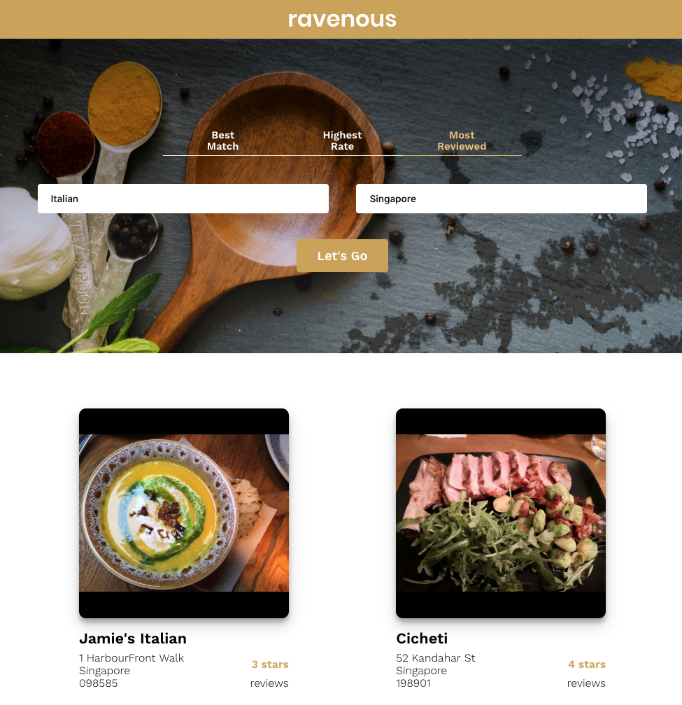
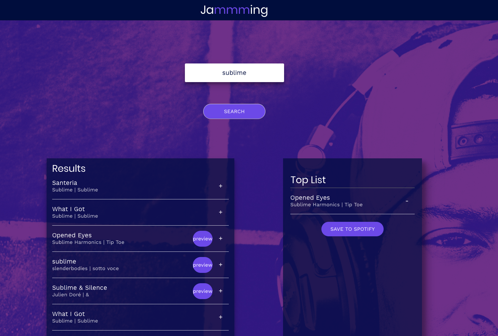
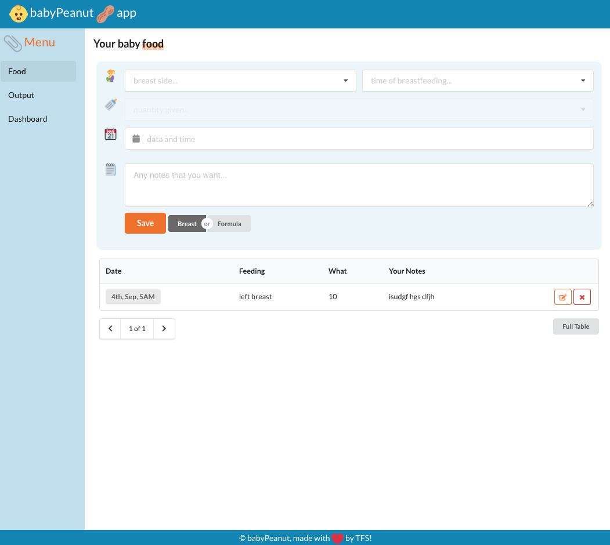
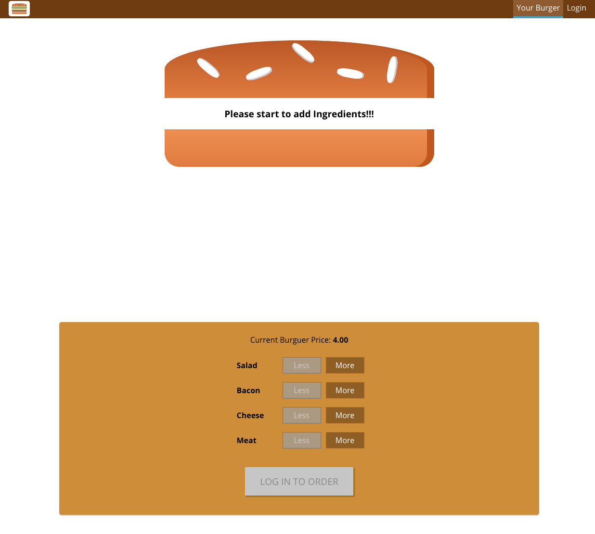

A couple of months back I have decided to learn how to code and it has been a journey sprinkled with amazing moments, but full with hard brick walls encounters, doubts and uncertainty. Learning something new takes a lot of time, being patient and, some would say, a little bit of obsession. That new thing is, by nature and virtue, something that you are not familiar with.

> To be more precise according to my [GitHub](https://github.com/tiagofsanchez) repo I started in **Dec. 2019**! That was when I have entered my first `git push`

I have made some progress since **December** but I am still a rookie with regards to coding. Back then, given that I was completely new to the topic, I had no idea where to start. There are so many online resources that it is difficult to choose.

With this post, I hope to be able to help folks that are in the same situation that I was. Bear in mind, this is a journey and it will not be an overnight success. If anything, and I am not trying to discourage anyone, you will be burning the midnight oil for a couple of months till you start to get the hang of it.

Make no assumptions, independent of the technologies that you aspire to learn, you will need to put a lot of hours into it. I reckon that learning to code is similar to learning a new language, you can know all the theory, but if you don't really practice it, you will loose it.

# Why I ventured into coding

Simply put, I wanted to be able to build stuff. To be autonomous. To create with my own hands, using tools that are out there and are, or rather should be, easy to work with. Going from a concept, through designing and building was something that I was fascinated with.

For a couple of years I have been drawn into this topic: **How does one becomes a developer?** or probably better and simpler, **How does one learn how to code?**.

# Where to start

For me one thing was clear - I wanted to see things being built. That was why I started with front-end development. As I mentioned before I was eager to see things being built and done.

As I write this, I receive 2 very interesting newsletters from [freecodecamp news](https://www.freecodecamp.org/news/). The first one entitled [beginners roadmap to web development](https://www.freecodecamp.org/news/beginners-roadmap-web-development/) and the second one with the more ambitious title [650 free online programming computer science courses you can start this summer](https://www.freecodecamp.org/news/650-free-online-programming-computer-science-courses-you-can-start-this-summer/).
Both are great posts that highlight the numerous sources of code and resources that one can tap into. On the other hand it could be overwhelming to anyone that is starting on this journey.

Despite all of the noise, if you really want to learn how to code, you need to choose between front-end or back-end. That will change the resources that you will be tapping into to learn faster.

For me, as I mentioned, front-end was the way to go, but it is impossible to shy away from back-end development as you will need at one point to store your data somewhere.

## Some of the resources that I used

Anyone starting with front-end development should have a good grasp of:

1. HTML,
2. CSS and
3. JavaScript
   As these are the fundamental technologies that build the internet. Basically whatever you "consume" online is "delivered" using this technologies on your webBrowser.

So, where to start? There is no right or wrong here and I probably didn't take the easiest path into learning front-end as I started with the [Codecademy](https://www.codecademy.com/learn/paths/build-web-apps-with-react) react online course, but hey... it was a great experience.

Here are my go to resources for online courses:

- [Codecademy](https://www.codecademy.com/);
- [FreeCodeCamp](https://www.freecodecamp.org/);
- [WesBos](https://wesbos.com/);
- [udemy](https://www.udemy.com/).

Other recourses that I couldn't live without:

- [GitHub](https://github.com/);
- [MDN web docs](https://developer.mozilla.org/en-US/)

# Experiments

It is all about trying new things and experimenting with the tech

Throughout this learning journey I have done a lot of projects and invested time trying to better understand the react ecosystem. Everything that I have been doing is with `ReactJS`.

## Ravenous

A web App that search for restaurants in a certain any city you would like to 🍲



| Details   |                               Links                                |
| --------- | :----------------------------------------------------------------: |
| Code Base | [burguerBuilder](https://github.com/tiagofsanchez/burguer-builder) |
| Platform  |                  [udemy](https://www.udemy.com/)                   |

Whilst I wonder through the code base and reflect on this project, a couple of things came to mind. For me, there where 3 main leanings:

1. Store data in the `state` of the app by defining the `state` and by using eventHandlers to `setState` in a immutable way.

```jsx
//defining the state
this.state = {
      term: '',
      location: '',
      sortBy:'best_match' ,
    };

//Get the term and the location out of the inputs
handleTermChange (event) {
    this.setState({term: event.target.value});
  }
handleLocationChange (event) {
    this.setState({ location: event.target.value });
  }
//this is in the render of my component
<input placeholder="Search Businesses" onChange={this.handleTermChange}/>
<input placeholder="Where?" onChange={this.handleLocationChange}/>
```

2. API's are 🤘! I have been a big fan of this way of sharing value where I can deliver information in a contextual way, but only going through it you fully understand it's implications and benefits. You can see how simple it can be by checking the `utils.js` on my git repo.
3. This was the project were I first understood the concept of reusable components, after creating the `Business.js` component and mapping the data points from [yelp!](https://www.yelp.com/) api into a new component `BusinessList.js` that would render them as follows:

```jsx
<div className="BusinessList">
  {this.props.businesses.map(business => (
    <Business key={business.id} business={business} />
  ))}
</div>
```

## Jamming

Creating a Spotify playlist 🎧 selector



| Details   |                                     Links                                      |
| --------- | :----------------------------------------------------------------------------: |
| Code Base |              [Jamming](https://github.com/tiagofsanchez/jammming)              |
| Platform  | [Codecademy](https://www.codecademy.com/learn/paths/build-web-apps-with-react) |

At that time this was, without a doubt, my most challenging project. I clearly remember the struggle, the ups and downs the numerous slack debates with the group of people that I was learning with... ahhh it was grueling, it did test my nerves, but it is important not to give up and keep pushing.

At the end of the project I did learn a lot:

1. Spotify API was probably the most challenging piece here. We needed to authenticate the user and get the user `accessToken` and get the `userId`. After validating the user one would need to be able to search for the music, artists or albums so that they would be render in a list. After that you would need to save it or not to the Spotify account. If you are keen to learn more just head to my code base and search for the `spotify.js` file under `utils` folder;
2. Another very interesting thing to note was the implications of UI rendering on your code base. One of the things that was asked, was to create a list of results according to the search parameters. The overall results could be selected from that list to be now part of the "Top List". The user should also be able to delete the songs on the "Top List".

```jsx
//in the App.js file you will find the App state
this.state = {
      searchResults: [],
      playListName: "Top List",
      playListTracks: [],
      popUpShow: false,
    }
// that we will change depending on the actions on the UI
//To add...
addTrack(track) {
    let tempPlaylist = this.state.playListTracks;
    if (this.state.playListTracks.find(savedTrack => savedTrack.id === track.id)) {
      return;
    } else {
      tempPlaylist.push(track);
      this.setState({ playListTracks: tempPlaylist })
    }
  }
//...and to delete
removeTrack(track) {
    const tempPlaylist = this.state.playListTracks;
    const newPlaylist = tempPlaylist.filter(removeTrack => removeTrack.id !== track.id);
    this.setState({
      playListTracks: newPlaylist
    });
  }
```

3. The other very interesting thing that I have learnt with this project, was how to programmatically change the `+` for `-` and keep everything on the `track.js` component in the same way when you change that track from "Search Results" to "Top List".

```jsx
// this is the method used in `track.js` component
renderAction() {
        if (this.props.isRemoval)
            return (<a className="Track-action" onClick={this.removeTrack}>-</a>);
        else
            return (<a className="Track-action" onClick={this.addTrack} >+</a>);
    }
//note that isRemoval prop is `false` for the trackList component in the SearchResults abd `true` in the PlayList component
```

## BabyPeanut

This was my first personal project. A web app to track the food intake of your baby 🥜



| Details   |                             Links                             |
| --------- | :-----------------------------------------------------------: |
| Code Base | [BabyPeanut](https://github.com/tiagofsanchez/babyPeanut-app) |

Yup, I know a very clunky design. But hey, it works and it was a good experiment. And let me tell you, doing something yourself instead of simply following an online course is completely different. You really need to think how to solve for different problems. So, what have I learnt with this mini-project:

1. This was the project where I started to use a couple of different libraries. For UI related stuff, I have used `semantic-ui-react`, for a UI calendar that gels well with semantic I have used `semantic-ui-calendar-react` and to style components I have used `styled-components`. And probably I used more than those, but for me the interesting thing was the fact that I was building something on top of someone's work. Let's look at some examples

```jsx
//Calendar example
import { DateTimeInput } from 'semantic-ui-calendar-react';

<DateTimeInput
  ...
  name='datetime'
  maxDate={new Date()}
  marked={new Date()}
  markColor="orange"
  ...
/>

//Let's say you just want a component that is a FlexBox
import styled from "styled-components";

const FlexBox = styled.div`
  display: flex;
  flex-direction: column;
  padding: 15px;
`;
//...
return (
  <Flexbox>
  {children}
  </Flexbox>
)
//...
```

2. To build better UI, I needed to understand CSS a little bit. This was a very interesting learning as I have totally ignored CSS, thinking that it was irrelevant and I wouldn't need it as much. But I literally hit a brick wall when I start to think about responsiveness and all that good stuff. Here is an example of such implementation:

```css
/* *********************************
*          Grid Styling           *
**********************************/

.field-container1 {
  display: grid;
  grid-template-columns: 25px 1fr 1fr;
  grid-template-rows: 40px 75px auto;
  grid-gap: 10px;
  grid-template-areas:
    " icon1 field1 field2 "
    " icon text text"
    " . button .";
}

/* *********************************
*         Grid Responsive         *
**********************************/

@media screen and (max-width: 580px) {
  .field-container1 {
    display: grid;
    grid-template-columns: auto;
    grid-template-rows: auto 40px 60px auto 75px auto;
    grid-template-areas:
      "icon1"
      "field1"
      "field2"
      "icon"
      "text"
      "button";
  }
}
```

For the most experience developers those things could seem super simple, and I probably would agree that they are, but for me, at that time, that was an amazing achievement.

## BurgerBuilder

A Web app where a user builds and purchases a Burger. A udemy project that I haven't finished 😥, so I def will need to get back at it as soon as possible!



| Details   |                               Links                                |
| --------- | :----------------------------------------------------------------: |
| Code Base | [burguerBuilder](https://github.com/tiagofsanchez/burguer-builder) |
| Platform  |                  [udemy](https://www.udemy.com/)                   |

> Damm, now that I am checking my Repo, it has been 5 months that I created this project. It goes to show that learning to code takes a lot of time and patience as I have yet to finish this!

To be completely honest, I feel that I need to do a proper post with just this project. End to end, explaining what I have learnt here as this was definitely the most complete project that I have tried to do and build. From an UI perspective I have learnt how to build and **sideDrawer** for my menu, have used **Redux** to manage state, learnt how to connect my web app to a **database** and manged to create an **authentication** functionality that enables any user to check their past orders.

Now I just need to find the time to (1) finalize the course and (2) summarize my learnings so that I reflect on them.

# So what is next

As I reflect on what I have learn till now, I realize how much I don't know and how much I still need to learn. For me the ultimate goal is to create, at least, 1 project, 1 PWA that will help people with whatever they are trying to do in a relevant way. It could be at work, with my "pet" project or something to do with BabyPenaut Web App or even better, something to do with surfing 🏄!

Having said that, I will be focusing on building up this blog, making a couple of changes to it as well as building up my skill set in a way that will enable be to build and ship a web app that is ready to use in the real world. At the moment I don't feel I am ready for it.

Till then, see you around!
