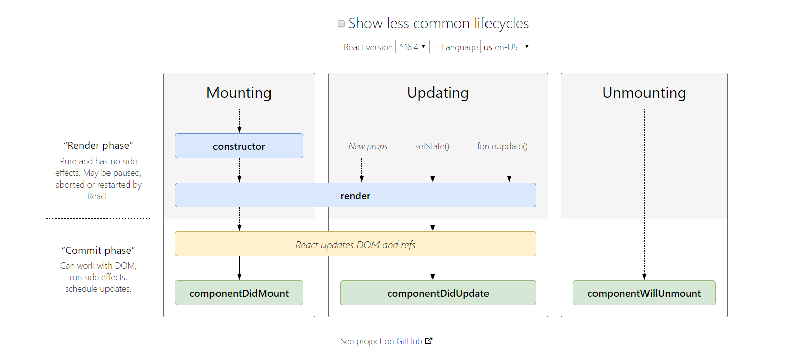

Two weeks ago I have started my [ReactJS Nanodegree](https://www.udacity.com/course/react-nanodegree--nd019) from UDACITY and I wanted to share what I have been through and what I have learned so far. For all intents and purposes this entry, and all the other ones that will follow, are a series of quick notes and reflections about ReactJS and are not intended to be a guide for anyone to learn React.

Despite the fact that I have been learning ReactJS for the past 1 year (oh yeah, 1 year as past by), and this concepts are not totally new to me, I reckon this is an opportunity to reflect on the basics and to consolidate my thinking about ReactJS.

Allow me to jot down a couple of things that I think are very important to know:

- React is all about reusable components
- You have different types of components
- State, props and constructor, when to use what
- Components have lifecycle
- PropTypes, a life savior
- React route, to create SPA
- Do you really need controlled components?

Before we start is good to highlight that React is, at the end of the day, just JavaScript. I will assume that you know JSX and that words like `state` and `props` are not totally alien to you. You also should be comfortable with ES6 syntax and the implications that functional programming have on JavaScript - if you need a quick refresher on that you can check this quick [introductory course](https://classroom.udacity.com/courses/ud356) from UDACITY.

# Reusable components

React is build on the principle that you build a larger UI pieces by composing different components together. You use JSX to describe small and manageable portions of your UI creating small elements instead of traditional rigid string elements.

The great thing about doing this is that you can reuse your components. Put it very simply, you will be able to write a piece of code that could be used for different users or even similar and repetitive content that you would like to render in the UI.

You can see this at work on the messaging app that we create on the course - you can check [my repo](https://github.com/tiagofsanchez/UdacityNanoDegree-W2-Ex2-AllTogether) of that exercise.

```jsx
//MessagingApp.js
const MessagingApp = props => {
  const { users, messages, onNewSms } = props;
  return (
    <div className="chat-window">
      <h2>Super Awesome Chat</h2>
      <div className="name sender">{users}</div>
      <SmsHistory messages={messages} users={users} />
      <SendSms users={users} onNewSms={onNewSms} />
    </div>
  );
};
```

The `MessagingApp.js` component is a great example of that: it renders the UI of a messaging app that will be, content wise, slightly different from user to user. Data from `props` will be passed to all children components, and as you can imagine the `SmsHistory.js` will displayed a different UI depending on the data passed to it.

It is interesting to note that the all components are reused depending on the user.

# There are different types of components

Yes, they can be different and it is important to be able to differentiate them. In short you have **(1)** functional components, **(2)** stateless functional components and **(3)** stateless components. Everyone should know the differences, why they are different and when to use each one of them.

On his [blog post](https://tylermcginnis.com/functional-components-vs-stateless-functional-components-vs-stateless-components/), Tyles Mcgginnis explains the differences really well, so I will not expand on that here. Just fell free to read his blog post.

# Props, State and Constructor

### Props

We have briefly touched on `props` before, so I will not dwell on it to much. For me, the thing to know is that `props` are attributes from parent components that get passed to children. They can **(1)** influence the UI rendering of a children component or **(2)** be used as a call back function that, in a way, grabs information from a children component to a parent. They are "read-only" and are immutable.

### State

When you introduce `state` to a component you can enable data mutation of `state` so that you can, depending on the user behavior, change the UI accordingly. You only can change the `state` of a given component in that component. To do that you will use `this.setState()` and everything is encapsulated in the component that you are modifying the state.

There are several different ways to use `setState()` and despite the fact I will not deep dive into them here, I will refer you to the original [Facebook documentation](https://reactjs.org/docs/state-and-lifecycle.html).

### Constructor

To be honest I am still struggling with why the `constructor` method exists. According to Dan Abramov on [why do we write super props](https://overreacted.io/why-do-we-write-super-props/) it is clear that you don't need the constructor anymore as there is [class fields proposal](https://github.com/tc39/proposal-class-fields) that enables you to access your `state ={}` using `this.state` and accessing the different methods on your class without binding them.

However, for reference it is important to note that, according to the [Facebook documentation](https://reactjs.org/docs/react-component.html#constructor) the constructor method are only used for two purposes:

- Initializing local state
- Binding event handlers

It is good to know this as you will probably find this in legacy codebase.

# Always use PropTypes

Now that you understand the data flow from parent components to children components it is worth introducing a very good package that will help you debug your app. PropTypes is a package that will allow you to define the data type each individual `prop` should have.

Before the course I never used it and found myself wasting hours on trying to debug very simple things that wouldn't have been a problem have I used PropTypes. Just go over their [library](https://www.npmjs.com/package/prop-types).

# Components Lifecycle

I reckon a picture, or in this case a diagram, are worth more than 1 thousand words. So instead of explaining the different component lifecycles I will only show the following diagram:



You can access this [here](http://projects.wojtekmaj.pl/react-lifecycle-methods-diagram/)

# React Router

This package turns React projects into single-page applications by managing the creation of links and URL's, providing transitions when navigating different URL's and rendering the right component depending on the user navigation.

If you would like to better understand React Router you use the following documentation:

- [Build your own React Router v4](https://tylermcginnis.com/build-your-own-react-router-v4/), from Tyler Mcgginnis
- [React training](https://reacttraining.com/)

# More materials

I know that all of the above is really brief and barely scratches the surface of the technical complexities of ReactJS. For more detail explanations and in-depth learning I would suggest you the following materials:

- [9 thinks every ReactJS beginner should know](https://camjackson.net/post/9-things-every-reactjs-beginner-should-know), from Cam Jackson
- [You're missing the point of React](https://medium.com/@dan_abramov/youre-missing-the-point-of-react-a20e34a51e1a), from Dan Abramov

I will be adding more links here as I will go along.
