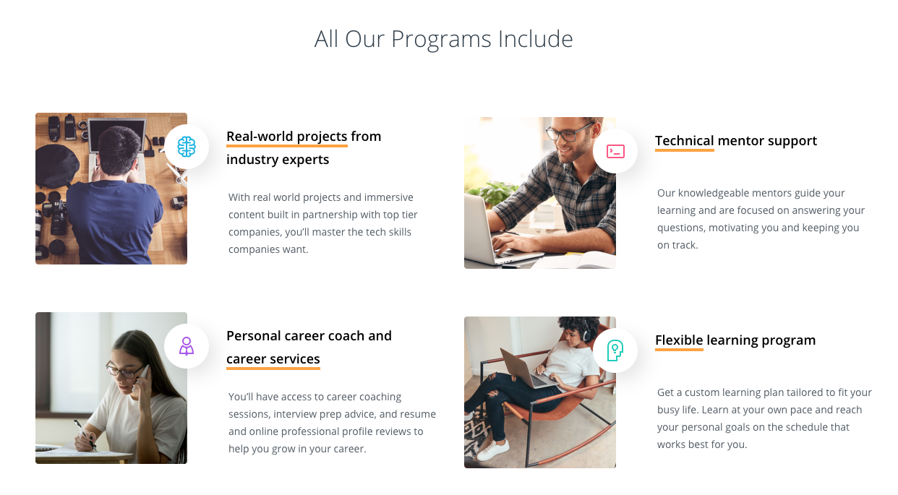

Four months have flown by, we had Christmas, New Year and I have finished my React Nanodegree course. I guess I am now a ReactJS and React Native developer. Well, at least I have got the certificate that says so 😂!

Having said that, this post is not only about celebrating this milestone, but rather to reflect on what you need to know if you chose to go through a similar process. I will try to explain what I have learnt through this program, the things that I liked, the things that I didn’t like and what I think UDACITY should do to improve them.

Throughout the program I tried to reflect on my learning and wrote a couple of posts articulating my points of view from a beginner's perspective. I will drop the link down below in case you want to check those:

- [React nanodegree, Flashcard App](/blog/2020-03-02-react-nanodegree-flashcard-app/)
- [React nanodegree, Would you rather App](/blog/2020-02-17-react-nanodegree-would-you-rather/)
- [React nanodegree, week 4 and 5](/blog/2019-12-28-react-nanodegree-week-4-and-5/)
- [React nanodegree, MyReads App](/blog/2019-12-15-react-nanodegree-myreads-App/)
- [React nanodegree, week 1 and 2](/blog/2019-12-06-react-nanodegree-week-1-and-2/)

I hope this gives you an idea not only on the amount of dedication you have to put in but also gives you a glimpse into the things you will learn.

It is also important to note that these are my views on the program and that 1 year back I barely knew the difference between HTML, CSS and JavaScript 😂.

## The good

Well that is easy, in short you will learn a lot, you will build up your confidence and you will get fantastic feedback on your projects (hmmmm, well not as much as UDACITY wants you to believe… more on that latter).

Content and theory aside one of the things that was really important for me was the fact that I had to work on projects that were “real life” projects. The combination between “code along” projects with “real life” ones was balanced with the “code along” projects being a little bit more complex in terms of functionality when compared with the “real life” projects. In essence it is fair to say that you will be learning by doing - this was what I liked the most about the program!

The theoretical explanations and its content are crisp, well design (with a few exceptions... more on that latter) and a great balance of theory combined with examples, illustrations and different calls to actions for you to practice what was taught.

Practice makes perfection and in my case it made me keener to better understand the theory that seats behind the scenes. In short, the program triggered my interest to the technical aspects of React as well as my interest in the ever changing dynamics of web development, a very dynamic practice that currently has massive impact on the way we consume and share information online.

Below I will be jotting down the main things you will be learning in case you take this course. A caveat though, this is not the course lexicon and, depending on the date you will be reading this, the content of the course might have changed (I certainly hope so… more on that latter).

Things that I think are really important:

- React is just JavaScript (I probably should learn more about JS :) )
- Whenever possible you should be reusing your components
- Components have lifecycles
- Data flows in one direction
- State and props will be used to mark the “components dirty” and re-render them
- Reat route will be fundamental to create your Single Page Applications
- PropTypes are a game changing and will make you applications more robust
- React & Redux as a way to manage the state of your application is amazing

Well, I reckon that sums it up for now. Before we dive in the not so great aspects of the program, it is worth mentioning that I really enjoy it and I can now say that my confidence level to tackle front end problems increase significantly.

## The bad

Ok, what were the things, in my view, that weren’t so great about the program? The program is not up to date and there are some very important new features that were never mentioned. Before I start a caveat: I totally understand that front-end web development is a very dynamic practice, that React is about 6 years old and you have new JavaScript frameworks popping up everyday.

So, what exactly is missing in the program? What about **React Hooks**? Why isn't that a fundamental part of the nanodegree? From what I understand and read, as always, there are divergent schools of thought, on the one hand you have developers pointing out that [Hooks are great but they are not a substitute of redux](https://medium.com/javascript-scene/do-react-hooks-replace-redux-210bab340672), on the other hand you have folks that say that [Hooks together with Context are an alternative to Redux](https://blog.logrocket.com/use-hooks-and-context-not-react-and-redux/). It seems that **React Context** is also missing from the program.

For me personally it would be fantastic to have a code-along session with a specific use case on how React Hooks and Context could be used together and contrasting this implementation with the same exercise using Redux. I am not, in any way, trying to push UDACITY to have a stance on what would be the best solution going forward, but rather leave the student with both solutions for app state management and let him decide. Imagine having that explanation from Tyler Mcginnis, that would be fantastic!

This might not be a deal breaker for you...and it surely wasn't one for me, but there were a couple of other things that, in my view, were really bad especially considering the price tag on the program.

## And the Ugly

Let’s start with one of the always advertised unique selling points about the UDACITY Nanodegree programs.

I want to draw your attention to the technical mentor support. In my case it was really hard to schedule calls with my assigned mentor and if memory doesn’t fail me I had 4 calls with him in 4 months. Considering the first call was more like an intro one could assume that I only had 3 calls with the mentor. I reckon my experience was not ideal. Having said that I wouldn’t necessarily classify this as a deal breaker given that in a way I had to find different solutions to my problems… and that is good.

The project submissions are expected to have a review and constructive feedback on the way you solve for the specific brief. For me this worked like a charm for 2 projects, I definitely learned a lot from those interactions and the feedback was fantastic. On the last project, the only one that I submitted with a specific request to evaluate my implementation, no review was provided. I confess I was a little bit disappointed by that. Not a deal breaker, though.

Last but not the least I want to mention that the React Native part of the program, for some probably an essential piece and the reason why they are subscribing to this course, is not up to date! The section is probably 2 to 3 years old ( I commented on two commits [here](https://github.com/udacity/reactnd-UdaciFitness-complete/commit/86af918722052eebafbc2892b6cd772b51a18dd4) and [here](https://github.com/udacity/reactnd-UdaciFitness-complete/commit/5d77f8d831e170fc0ffdeae1bc92a0825e71e14a) mentioning that). I reckon this is bad and hope UDACITY reviews this as soon as possible.

## A word to UDACITY

I think you have a great platform and a phenomenal community. It is sad to see, though, that content is not updated for more than 2 to 3 years and this is definitely not what students expect from the program, nor from UDACITY. Do let me know if I am wrong here... However, if my assessment of the situation is correct, what is Udacity going to do to compensate all students that had this problem?

Jotting down a couple of ideas:

- You could prepare an updated module and invite old students
- Depending on how much students paid, you could partially refund them
- You could invite students to another course of their choosing for a discounted rate

What do you think UDACITY?

## A final world

Despite the very unfortunate situation with the React Native segment I really enjoyed the program given the balance between theory and projects. I definitely learnt a lot and boosted my confidence level. I would do it again!

Last but certainly not the least, a big thanks to Marta, my better half, for understanding my absence after dinner as I constantly removed myself to our little office and grind through the night looking to a black screen sprinkled with green and pink colored letters. Without your support and you pushing me to pursue my crazy ideas (what kind of middle aged person wants to learn how to code ?) this wouldn’t be possible - THANK YOU for that.

Unfortunately I don’t have very good news for you: I think I might be addicted to this newly found craft. I think, go figure... I like to code!

See you around and keep doing what you like!
