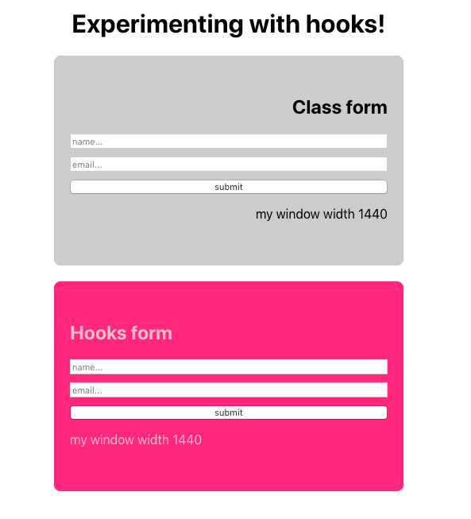

You need to learn about React Hooks, let me try to tell you why!

First, allow me to digress and share my personal views why I venture into Hooks. I was very keen to know if there was a way to build a React application without thinking too much about where the data should live in and how it should be rendered in the Dom. For me it was always a little bit challenging to decide at the beginning of a project where my data should be stored, if a certain component needed to be a class component or we would be fine with it being a functional component.  

For me this was definitely a problem, but one could argue, that this is a boilerplate issue and nothing more than that. However, if you think about the added complexity of components lifecycle and their different methods, you will probably agree that this building a class component and adding logic to that component can quickly increase the complexity of your project and component. I reckon this is a good enough reason to give hooks a try as they look so much cleaner. 
     
Another big issue, in my view, is that React, in a way, was not living up to their promise of reusable components. If this sounds strange to you is probably because you are thinking about functional components. For a functional component that renders UI this doesn’t make sense, however to reuse a component that contains certain logic and state, reusing that component could create a lot of problems and what is called a wrapper hell by implementing higher order components. 

Last but certainly not the least I was always a little bit confused with lifecycle events, when to use them, and why it always seemed that I was splitting my logic through the component livecycles methods.

I was sold once I learnt that hooks would help me:
- Not needing to write class components; 
- Avoiding logic duplication; 
- Making it easier to refactor my components; 

Let me try to give one example of a typical form that you would have in your website - We will be building a typical class component and a component using hooks to compare the differences. After, we will also go through a `Context` example in order to illustrate the useContext hook, we will experiment with side effects. Just to make things fun we are also going to connect our forms to Airtable.

This would be your expected outcome: 



Let's get started. 

# Managing state

Here we will go through both types of components and try to explain the differences between managing state in a class component vs a functional component using hooks. 

You can use the [commits](https://github.com/tiagofsanchez/hooks-examples/commits/master) on the repo created to follow through. In this case, use *managing state on both class and functional components* for this piece.

## State in a class component

If you are not new to react, this should be a typical form implementation. Below you will see 3 important things in our `classForm.js`: (1) component rendering a form in your DOM; (2) state object with `name` and `email` properties and; (3)  both change handlers (yes, we can consolidate both change handlers, but bear with me on this) 

```js
import React, { Component } from "react";
import "./form.css";
 
class ClassForm extends Component {
  
  state = {
    name: "",
    email: "",
  };
 
  onChangeHandlerName = (e) => {
    this.setState({
      name: e.target.value,
    });
  };
 
  onChangeHandlerEmail = (e) => { 
    this.setState({
      email: e.target.value
    })
  }
 
  render() {
    const { name, email } = this.state;
 
    return (
      <section>
        <form className="form">
          <h1>Class form</h1>
          <input
            className="input"
            placeholder="name..."
            type="text"
            name="name"
            value={name}
            onChange={this.onChangeHandlerName}
          ></input>
          <input
            className="input"
            placeholder="email..."
            type="email"
            name="email"
            value={email}
            onChange={this.onChangeHandlerEmail}
          ></input>
          <button>submit</button>
        </form>
      </section>
    );
  }
}
 
export default ClassForm;
```

## State with hooks

The `hooksForm.js` component will be a functional component so now the big question is, how can we grab state in a functional component? Enter `useState`, react hook that will help us keep tabs with the state of a given functional component. 

> const [state, setState] = useState(initialState)

`useState `is a function that returns a stateful value, in our example state, and a function to update it, in our example setState. I will not go super deep on this as the original hooks [documentation](https://reactjs.org/docs/hooks-intro.html) is very good.

You can now check our `hooksForm.js` component to see how this would work in practice 

```js
import React, { useState } from "react";
import "./form.css";
 
const HooksFrom = () => {
  const [name, setName] = useState("");
  const [email, setEmail] = useState("");
 
  const onChangeHandlerName = e => {
    setName(e.target.value)
  }
  const onChangeHandlerEmail = e => { 
    setEmail(e.target.value)
  }
  
  return (
    <section>
      <form className="form">
        <h1>Hooks form</h1>
        <input
          className="input"
          placeholder="name..."
          value={name}
          onChange={onChangeHandlerName}
        ></input>
        <input
          className="input"
          placeholder="email..."
          value={email}
          onChange={onChangeHandlerEmail}
        ></input>
        <button>submit</button>
      </form>
    </section>
  );
};
 
export default HooksFrom;
```

We defined the state for `name` and `email` separately with two different `useState` functions and for us the initial value is “” - this can be seen in the form itself. The other major difference when comparing with our class component is very visible in our handler methods, instead of `setState` we will have `setName` and `setEmail` to update both name and email. 

Not so visible, but very important is the fact that in `useState` the stateful variable doesn’t need to be an object, it can be anything; we can choose to have a string, array or object.

As you can see, now we can have state defined and managed in a functional component 💪 !

## Theme using Context
Let's assume that you are familiar with Context and the great benefits that `Context` brings when trying to consume props irrespective of your component localization and hierarchy on your component tree. 

You can use the [commits](https://github.com/tiagofsanchez/hooks-examples/commits/master) to follow through. In this case, use *use Context in both class and funtional components* for this piece.

If this is completely new to you check out `Context` original [documentation](https://reactjs.org/docs/context.html) to better understand the concept. In short `Context` gives you access to props without the need of prop drilling. 

For this particular example we have created `context.js` that would contain a different theme for each component

```js
import React from "react";
 
const theme = {
  themeClass: {
    backgroundColor: `#cccccc`,
    borderRadius: `8px`,
    marginBottom: `20px`,
    textAlign: `right`
  },
  themeHooks: {
    backgroundColor: `#FB4E83`,
    borderRadius: `8px`,
    color: `pink`,
    textAlign: `left`,
  },
};
 
export const ThemeContext = React.createContext(theme);
```
As you can see we have created a `theme` object with two properties, one that will be used for our class form and the other one for our form that will be using hooks. 

## Context in the class component

Here we will import `ThemeContext` from `context.js` and use `ThemeContext.Consumer` to render `theme` props to have access to `theme.themeClass` and style our form. 

```js
{...}
import { ThemeContext } from "./context";
 
class ClassForm extends Component {
{...}
  render() {
    const { name, email } = this.state;
 
    return (
      <ThemeContext.Consumer>
        {(theme) => (
          <section style={theme.themeClass}>
            <form className="form">
              <h1>Class form</h1>
              <input
                className="input"
                placeholder="name..."
                type="text"
                name="name"
                value={name}
                onChange={this.onChangeHandlerName}
              ></input>
              <input
                className="input"
                placeholder="email..."
                type="email"
                name="email"
                value={email}
                onChange={this.onChangeHandlerEmail}
              ></input>
              <button>submit</button>
            </form>
          </section>
        )}
      </ThemeContext.Consumer>
    );
  }
}
{...}
```

## Theming using hooks

Using hooks we will end up with the same result, however we will not need to render props to have access to `theme.themeHooks` property. 

```js
{...}
const theme = useContext(ThemeContext)

{...}
  
  return (
    <section style={theme.themeHooks}>
      <form className="form">
        <h1>Hooks form</h1>
        <input
          className="input"
          placeholder="name..."
          value={name}
          onChange={onChangeHandlerName}
        ></input>
        <input
          className="input"
          placeholder="email..."
          value={email}
          onChange={onChangeHandlerEmail}
        ></input>
        <button>submit</button>
      </form>
    </section>
  );
};
 
{...}

```
As you can see `useContext` will bring a lot of simplicity when compared to the render props approach. If you want to learn more about this specific hook you can head to react original [documentation](https://reactjs.org/docs/hooks-reference.html#usecontext).


# Side effects

Here we will show the difference approaches in implementing a side effect that needs to be cleaned up. We will be tapping into the browser window API to check for the width on the window and to render that value dynamically in the browser whenever the width of the window changes. 

You can use the list of [commits](https://github.com/tiagofsanchez/hooks-examples/commits/master) to follow through. In this case, use *implement managing side effects in both forms* for this piece. Please bear in mind that the commit order is not exactly the same as the post order, e.g. I have connected the form to Airtable before going through the side effects.

## Side effect in a class component

We will have to start with adding `width` to the state of our component and add 2 event listeners in different lifecycle methods so that the `width` changes every time the component mounts as well as to remove that, and clean up memory, every time the component unmounts. Both event listeners will need to be connected to a method that updates the state.     

```js
{...}
  state = {
    name: "",
    email: "",
    width: window.innerWidth,
  };

  componentDidMount() {
    window.addEventListener("resize", this.handleResize);
  }

  componentWillUnmount() {
    window.removeEventListener("resize", this.handleResize);
  }

  handleResize = () => {
    this.setState({
      width: window.innerWidth,
    });
  };
{...}
```

## Side effect with hooks

Here we only need to create a new "state" slice, in this case width by using our `useState` like we did before. However we will now introduce the use of `useEffect`, the hook that could be seen as the substitute for `componentDidMount`, `componentDidUpdate` and `componentWillUnmount`, but is not quite the same thing. 

If this is the first time seeing this, I would suggest that you go through react [documentation](https://reactjs.org/docs/hooks-effect.html) about `useEffect` or, if you are brave enough, check Dan Abramov post; [A complete guide to useEffect](https://overreacted.io/a-complete-guide-to-useeffect/). 

> useEffect(fn, [])

`useEffect` can be a little bit complicated, you might need to use `useCallBack` hook (not explained here) to avoid an infinite refetching loop or you might need to identify, with [], values that don't go into React data flow and should be only applied once... well, there is still a lot more to learn and experiment with this hook. 

In short, the one thing that you should have in your mind is that when you are using `useEffect` what you are basically saying is: use this effect, or run this piece of code, after flushing changes to the DOM.

```js
{...}

const [width, setWidth] = useState(window.innerWidth);
  useEffect(() => {
    const handleResize = () => setWidth(window.innerWidth);
    window.addEventListener("resize", handleResize);
    return () => window.removeEventListener("resize", handleResize);
  });
{...}
```

As you can see, our hook form is simpler and you can actually narrow down the logic in a way that is easier to isolate and understand. 

# Simplifying our code

Ok, so we do have long components and you probably notice a couple of things that we could change and improve in our code. Let's do just that and start with our class component.

## Improving our class

In the class component the one thing we could be doing is simplifying our `onChangeHandler`. Now we only have one event handler for both inputs.

```js
...

onChangeHandler = (e) => { 
    this.setState({
      [e.target.name]: e.target.value
    })
  }

...
```

## Custom hooks

This is where the fun begins, to simplify our functional component we will need to create a custom hook. Let's have a look at what that means for the width piece that we mentioned before.

```js
...
 const width = useWindowWidth()
...
const useWindowWidth = () => { 
  const [width, setWidth] = useState(window.innerWidth);
  useEffect(() => {
    const handleResize = () => setWidth(window.innerWidth);
    window.addEventListener("resize", handleResize);
    return () => window.removeEventListener("resize", handleResize);
  });
  return width
}
...
```
Here we simply extracted the logic of our width and created this new function called `useWindowWith` that will return the width value for us. Given that this logic was extracted we can now use the same in any component that needs this. 

A more complex example would be to extract the logic around the input that is being stored in state. In that particular case the auxiliary function will be a little bit more complicated but the usage of that function will be very similar

```js
...
const name = useFormInput("")
const email = useFormInput("")
...
 return (
    <section style={theme.themeHooks}>
      <form className="form" onSubmit={onSubmitHandler}>
        <h1>Hooks form</h1>
        <input
          className="input"
          placeholder="name..."
          type="text"
         {...name}
        />
 )
...
const useFormInput = (initialValue) => { 
  const [value, setValue] = useState(initialValue);
  const onChangeHandler = (e) => {
    setValue(e.target.value);
  };
  return {
    value, 
    onChange: onChangeHandler
  }
}

```

Again, this logic was extracted from the component and can be reused in any other component and that is just fantastic!

# Connecting the forms to Airtable

If you have a form, you need to store the information somewhere. Here you will find and example on how to connect your form into Airtable.

You can use the list of [commits](https://github.com/tiagofsanchez/hooks-examples/commits/master) to follow through. In this case, use *connect both forms to airtable* for this piece. Please bear in mind that the commit order is not exactly the same as the post order, e.g. I have connected the form to Airtable before going through the side effects.

I have created to tables in Airtable and pointed the our class from for one table and our functional component to the other. It is important to note that we will be using [axios](https://www.npmjs.com/package/axios) and creating a airtableAPI.js to code the logic of pushing the data to Airtable

```js 
import axios from "axios";

//params for the airtable
const app_id = process.env.REACT_APP_AIRTABLE_BASE_ID;
const app_key = process.env.REACT_APP_AIRTABLE_API_KEY;

const classView = "classForm";
const hooksView = "hooksForm";

export const addEmailClassForm = (name, email) => {
  const data = {
    records: [
      {
        fields: {
          Name: name,
          Email: email,
        },
      },
    ],
  };
  

  let url = "https://api.airtable.com/v0/" + app_id + "/" + classView;
  let axiosConfig = {
    headers: {
      Authorization: "Bearer " + app_key,
      "Content-Type": "application/json",
    },
  };

  axios
    .post(url, data, axiosConfig)
    .then((resp) => console.log("Email received"))
    .catch((error) => console.log(error));
};
```


# Conclusion

There is still a lot of things to learn around hooks and this post barely touches the surface on the topic, hopefully it gives you a gist of the power of hooks and how they can change the way you use React. Despite the fact that personally I still need to learn a lot, for me it is very simple, goodbye class components and hello hooks! 

See you around, stay safe and keep doing what you like!


