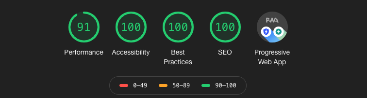
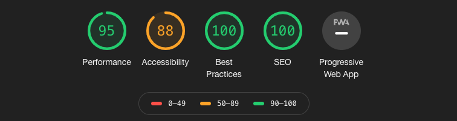

I seriously believe that you are using social media in a wrong way.

It is interesting to note the growth in the number of social media posts in the past couple of months. LinkedIn is on fire, we are all adding content to Medium (I am not though) and twittes seem to be spreading like weed. I am not totally sure why this is happening but I suspect the current pandemic and the fact that people want to be perceived as being busy to be the main culprit. But really, why are we all doing that? Why are we all sharing our thoughts online? 

Personally I write because I want to learn a certain topic and want to share that with you. It is not necessarily to showoff or anything like that, I do it because I enjoy the process of putting stuff on paper and what I learn by doing that. As a result I am able to, hopefully, improve the way I write and convey my points of views. In short the quote from **Yogi Bhajan** sums it pretty well

> If you want to learn something, read about it. If you want to understand something, write about it. If you want to master something, teach it.
> **Yogi Bhajan** 

Hmm, ok... I am missing the teaching piece, but you got the gist.

As a result I have put this digital place together. Without totally knowing this is my digital garden.   

# A Digital Garden

What is that? A digital what!! 

Well, I totally understand your reaction right now, but let me expand on this concept that basically is a metaphor for thinking about a blog (or writing in general) that doesn't give to much emphasis on the result but rather on the process and the craft of building something that eventually could became something bigger.   

You get your hands dirty on a garden. A garden is a place to make things grow. Some harvests will flourish, others will die and like any other garden you will need to keep trying to plant good seeds and pull the weeds out. 

Easier said than done. Organizing thoughts, ideas and concepts, even technical ones is, literally, a pain! 

The beauty of building a digital garden is that it doesn't need to be perfect, it is a never ending work in progress - your personal learning sandbox! 

At the end of the day my posts are in various evolutionary stages, like plants, same are good others are simply terrible and a lot of them are work in progress.   

## Inspired by

This is not a new concept and I draw inspiration from the following amazing posts: 

- [What is a Digital Garden](https://www.christopherbiscardi.com/what-is-a-digital-garden), by Chris 
- [Digital Garden](https://joelhooks.com/digital-garden), by Joel
- [Of Gardens and Wikis](https://tomcritchlow.com/2018/10/10/of-gardens-and-wikis/), by Tom

# At least try to be digital 

Irrespective of your willingness or not to set up your onw digital garden (a.k.a. personal blog) you should at the very minimum try to share your content in a truly digital format. No, a PDF, PPT or WORD document on LinkedIn is not being digital. 

The problem with this is very simple - documents are not search engine optimize. This basically means that all that work and effort you have put into that idea or concept will only live for a very short period of time - as long as the likes and shares will last. If you are creating content you need to be aware about the implications of search engine optimization (SEO), that crawlers can't access documents that well, but are very good at going through a web page and my posts.  

I am not even going down the path that you might be wasting a fantastic opportunity to improve your brand, if you are a company, or even to establish yourself as expert on XYZ topic. You definitely should channel all that effort into designing something that can outlive the number of likes you will get. 

But this is not the only issue.

# Platforms change

At the end of the day the content that you post in any given platform is not totally yours. You think it is, you probably think that you own that content, however reality is very different. As a simple example, and we are just grasping the surface, readers on Medium can only read three post per month without a subscription. You definitely can argue that the publishers can make money depending on engagement, however the rules of the game are not particularly clear. What's more, those rules can change overnight.  

Any social platform that we use can reserve the right to change their model whenever they want. That for me is a big problem. 

One of my favorite post ever about someone leaving Medium is from Dan Abramov on his post [Why my new blog isn't on medium](https://medium.com/@dan_abramov/why-my-new-blog-isnt-on-medium-3b280282fbae). I encourage you to check his reasonin- It is very interesting.  

# Your Digital Garden

I also want to offer you a solution to build your own digital garden so I have created this template for anyone to use. With that in mind I have created two gatsby-themes: 

1. A theme for ACME 
2. My website theme

They are both completely free. 

## TFS digital garden theme

If you are reading this you are already using the theme and the good news is, if you like it you are more than welcome to use it and make it your own: 

- You can directly install the npm package for the theme [here](https://www.npmjs.com/package/gatsby-theme-tfs)
- I will work to get the gatsby-starter for the theme on the gatsby library as well 

Performance wise the, my website is looking good, but there are a couple of things that I will be working on to improve it.

## ACME theme

You can check out a live demo of the ACME theme [here](https://gatsby-tfs-acme-starter.netlify.app/). Basically you have 2 simple ways to use the theme:

- You can directly load the npm package for the theme [here](https://www.npmjs.com/package/gatsby-theme-acmeblog)
- I will work to get the gatsby-starter for the theme on the gatsby library as well 

I have tried to optimize the theme however I know is still not perfect.

# A WIP Theme 

Similar to a any digital garden both themes are still work in progress and whilst performance wise they are not bad, there are a couple of things that I need to do to improve both. I will be improving the theme over the course of next couple of months and will change this post accordingly. 

I hope this is helpful and thank you for reading this far!
 

