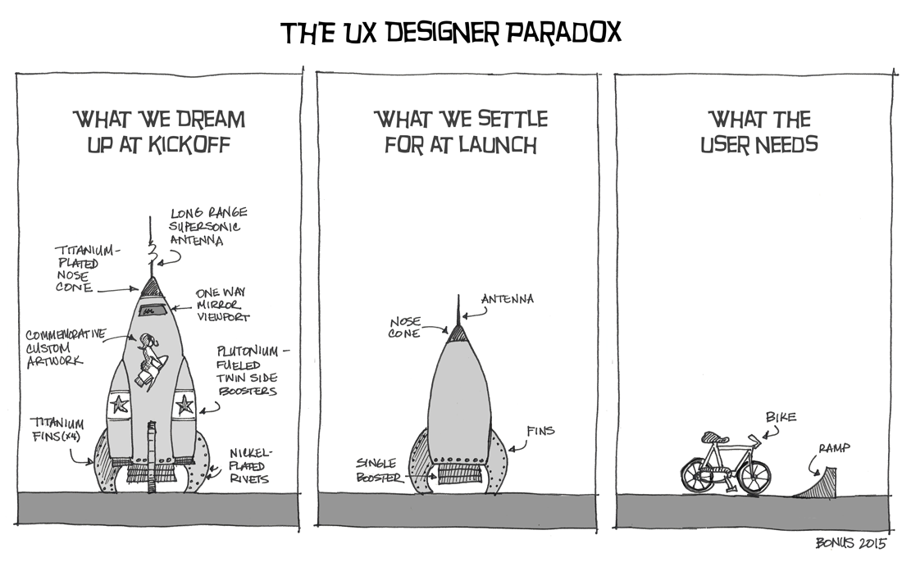

The case for over-engineering stuff, even when everyone disagrees. 

Common sense has it that we should simplify, strip down to the minimal, focus on the bare bones while we are building something. Same called this the minimal viable product others the minimal loveable product.  

What is that 1 thing that the client really needs? 



We generally all aim for the moon but normally can't even overcome the stratosphere.
 
And that is ok, our ambition should be big, that is the thing that drives anyone that is trying to build a product, find an audience or even learn a new topic.

In the developer world there is this rule of thump that you are over-engineering in the following situation: 

>Your code solves problems you don't have

You can read the post from [Jeff Sternal](https://stackoverflow.com/questions/1941770/concrete-symptoms-of-over-engineering) that elaborates on this topic or if you really want to have an holistic view on this just go over [Amanda Woo's](https://medium.com/better-programming/overengineering-why-we-do-it-and-10-ways-to-tackle-it-460663d35ff3) post.

I totally agree with their views, however if you are learning a new technology or a new topic and you really want explore the possibilities and the solutions that a certain technology brings you, you have to over-engineer. You have to try it yourself to fully understand the implications. 

For me, to continue learning web development, my [digital garden](https://www.tiagofsanchez.com/blog/2020-07-06-you-should-have-a-digital-garden/) is the perfect launchpad for over-engineering. 

Last week I have implemented 2 really nice features.

# Over-engineering your digital garden
 
Before we dive into detail, let me explain my blog development workflow from a conceptual perspective. 

## Workflow

With gatsby-themes I am able to have a separation of concerns between data piping, the ui and the content for the blog

- **Data Piping** - My blog was built on the back of [gatsby-theme-acmeblog-data](https://www.npmjs.com/package/gatsby-theme-acmeblog-data)
- **My UI** - The way that all is rendered in the browser is defined by [gatsby-theme-tfs](https://www.npmjs.com/package/gatsby-theme-tfs)
- **The content** - All the content is hosted on my github [repo](https://github.com/tiagofsanchez/tiagofsanchez)

As a result my blog is being managed by 3 repositories and anytime I want to change the UI, I can do it either by shadowing `gatsby-theme-tfs` on my blog repo or directly by working on the theme. 

Normally, every time that I want to improve the UI or implement anything I work on the content repo and once I am happy I push that either to the data or UI code repo. 

To make the changes accessible to everyone I publish the respective npm packages and update the code that stores the content. 

Ok, with the workflow out of the way, let's go and explore the features that I have implemented. 

## Like feature

In a very simple way I wanted to have the clap feature that Medium has, but here implemented with a heart ❤️. You can like as much as you want.  

At the very high level I needed to think about two things, (1) the UI and (2) where those likes would be stored. For the storage I am using [Firebase](https://firebase.google.com/) and for the UI a simple react component. 

It is nice to know that gatsby enables hybrid web applications, with content being rendered at build and runtime. If you are keen to learn more how this works, you can check their [blog post](https://www.gatsbyjs.org/docs/data-fetching/) on it.

Let's quickly jump into the like component, I called this component `palmas.js`... palmas is Portuguese for claps... anyhow!

```jsx:title=src/components/palmas.js
import { useState, useEffect } from "react";
/** @jsx jsx */
import { jsx } from "theme-ui";
import styled from "@emotion/styled";

import { addLikesToDB, gedLikesFromDB } from "../utils/api";
import heart from "../logos/heart.svg";

const LikeContainer = styled.div`
  display: grid;
  grid-template-columns: 60px 1fr;
  justify-items: start;
  margin: auto;
  grid-gap: 15px;
`;

const Button = styled.button`
  display: contents;
  cursor: pointer;
`;

const ImgContainer = styled.img`
  width: auto;
  padding: 10px;
  border-radius: 50%;
  box-shadow: 1px 2px 10px rgba(82, 21, 41, 0.5);
  &:hover {
    box-shadow: 1px 2px 10px rgba(82, 21, 41, 3);
  }
`;

const Palmas = ({ title }) => {
  const [likes, setLikes] = useState("");
  const [id, setId] = useState("");

  useEffect(() => {
    gedLikesFromDB(title, setId, setLikes);
  }, [title]);

  const addLikes = () => {
    addLikesToDB(id, likes, title, setLikes, setId);
  };

  return (
    <LikeContainer>
      <Button onClick={addLikes}>
        <ImgContainer src={heart} alt="Tap if you like the post" sx={{bg:`hover`}}/>
      </Button>
      {likes ? (
        <p sx={{ textAlign: `center` }}>
          <span sx={{ color: `highlight` }}>{likes}</span> readers liked!
        </p>
      ) : (
        <p>Be the first one to like</p>
      )}
    </LikeContainer>
  );
};

export default Palmas;
```

As you can see in this component I am using hooks to **pull**, **store** and **update** the number of likes for a particular post. 

Please note that I will write a detailed post about how to set up the like feature if this post gets over 50 likes.  

## Syntax highlight using theme-ui

This was a little bit tricky, and similarly to the like feature, I need to write a detailed post explaining how to implement this. 

Alternatively, if you can't wait, do yourself a favor and check Chris's [tutorial](https://egghead.io/playlists/building-websites-with-mdx-and-gatsby-161e9529) about how to use MDX with gatsby and more importantly on how to implement a syntax highlight on your code element. 

At a very high level I needed to think about three main things, (1) Implement how the `code` should look like, (2) how to pass the code title and styled it and (3) needed to shadow `theme-ui` and bring all styling details into the content repo (this for now, once I am completely happy with the implementation I will push the code to `gatsby-theme-tfs`).

On to the my code component you will find the following:

```jsx:title=src/component/code.js
import React from "react";
import { LiveProvider, LiveEditor, LiveError, LivePreview } from "react-live";
import theme from "prism-react-renderer/themes/nightOwl";
import Highlight, { defaultProps } from "prism-react-renderer";
import Title from "../components/title";

const LiveCode = (props) => {
  return (
    <LiveProvider code={props.children.props.children.trim()} theme={theme}>
      <LiveEditor />
      <LiveError />
      <LivePreview />
    </LiveProvider>
  );
};

const getParams = (className = ``) => {
  const [lang = ``, params = ``] = className.split(`:`);
  return [lang.split(`language-`).pop().split(`{`).shift()].concat(
    params.split(`&`).reduce((merged, param) => {
      const [key, value] = param.split(`=`);
      merged[key] = value;
      return merged;
    }, {})
  );
};

const SyntaxHiglight = (props) => {
  const className = props.children.props.className || "";
  const [language, { title = `` }] = getParams(className);
  const ifTitle = (title || language) && { marginTop: `0px` };
  return (
    <Highlight
      {...defaultProps}
      theme={theme}
      code={props.children.props.children.trim()}
      language={language}
    >
      {({ className, style, tokens, getLineProps, getTokenProps }) => (
        <>
          <Title className="code-title" text={title}>
            {language}
          </Title>
          <div className="gatsby-highlight" data-language={language}>
            <pre className={className} style={{ ...style, ...ifTitle }}>
              {tokens.map((line, i) => (
                <div {...getLineProps({ line, key: i })}>
                  {line.map((token, key) => (
                    <span {...getTokenProps({ token, key })} />
                  ))}
                </div>
              ))}
            </pre>
          </div>
        </>
      )}
    </Highlight>
  );
};

const Code = (props) => {
  console.log(props);
  if (props.children.props["react-live"]) {
    return <LiveCode {...props} />;
  } else {
    return <SyntaxHiglight {...props} />;
  }
};

export default Code;
```

For this to work with `theme-ui` I need, as I mentioned, to shadow `gatsby-plugin-theme-ui` and change the following file accordingly: 

```jsx:title=src/gatsby-plugin-theme-ui
import React from "react";
import Code from "../components/code";

const components = {
  pre: (props) => <Code {...props} />,
};
export default components;
```

Ok, all of this is not straightforward so I have put together a more detailed post. You can check out the [Code Line Highlight With prism-react-renderer](https://www.tiagofsanchez.com/blog/2020-08-06-code-line-highlight-with-prism-react-renderer/) post if you would like.   

# Conclusion

Yes, I know, in a way it seems that I am reinventing the wheel. And that is completely ok! 

I could definitely use a blogging platform, download a theme and pump up content. However, that will deceive the purpose of this digital garden - learning by doing is very important for me, as it should be.

What's more, if you compare the performance of any other blogging platform, coupled with the flexibility and richness of a gatsby blog on top of MDX, you quickly realize this is the best available option if you use and like react. 

In short, I am big in over-engineering if your end goal is learning something new. 

That's it for now, thank you for reading ... ah, and now you can hit that ❤️ like button bellow! Fell free to abuse it! 

