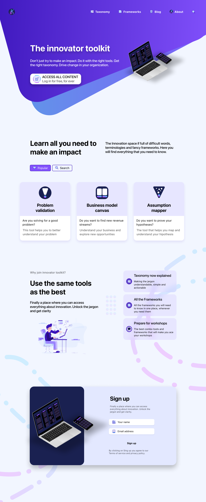

My first week on my personal **#100DayProject 🥳**.

It was an interesting week, challenging, as I am trying to learn a bunch of new things, but great in the amount of stuff that I was able to do. O
verall I am happy with progress and wanted to share a couple of things here.

I will be splitting this post in two parts. The first will be all about the UI components and what I have done in Figma, mostly due to the 
[UI design for developers](https://designcode.io/ui-design-for-developers) crash course from Design+Code. The second thing will be about learning how 
to use authentication in gatsby. (basically how to have a user log in).

Let's get started.

# Wireframing done simple

Figma is great to create your high level wireframes and stories for the product that you want to build. Needles to say that I think this is a very important
exercise for anyone trying to build a digital first product. Going through the process makes you think about the different screens you would need to build, the most 
important pieces of information you will need and how to stich them together to provide a niece experience for the user.

By all means, the bellow wireframe is far from perfect and I am missing screens and details, however this simple wireframe gave me the confidence needed to play 
with more high fidelity wireframing and designs.

More importantly, the wireframing exercise helps to crystalize your idea and concept and will save time when building a high fidelity UI, not to 
mention when you want to present your concept to someone else.

Here you will focus on the overall story, flow and customer journey. When you are putting the UI together you are more detailed oriented and starting to build in a component 
based approach, very similar to the way react works - and this, despite never tried any other design tool, is something that I love about figma.

# (Trying to) build a clean UI

Trying to build a clean UI, that is visually appealing, intuitive and user friendly is a balancing act between color, gradients, forms, shapes, shades, illustrations, 
typography, space, depth and hierarchy. In short, it is hard to build something that looks nice, is consistence and works well.

As you can imagine, this is not the final version of the landing page, but I reckon that this first stab helps to put the concept I am trying to build in perspective - Yes, I will be
putting together all the tools that I have learnt by driving corporate startup engagements, and the idea will be to start from problem discovery followed by sourcing and deal flow and so on. 
This will be a open sourced initiative that will try to borrow great concepts from the open source community. More on that on another post.

We all have to think, no matter what we are building, that we need to have a good design system - if this is a new term for you I encourage you to read 
[every thing you need to know about design systems](https://uxdesign.cc/everything-you-need-to-know-about-design-systems-54b109851969), from Audrey Hacq. I am not there yet, 
but what is very interesting for me is that while building the landing page I also started to build small pieces of the design system.

While going through the process of putting together the landing page I learnt about the existence of the following very useful resources:

- [Human Interface Guidelines](https://developer.apple.com/design/human-interface-guidelines/ios/overview/themes/), design system from Apple
- [Material Design](https://material.io/design), design system from google
- [Dribbble](https://dribbble.com/), for general design inspirations
- [Mobbin](https://mobbin.design/), for mobile design inspirations

A big caveat though, it is very, very, very easy to get completely lost on all this amazing resources, spend huge amounts of time on them and produce close to nothing. If you don't believe me, 
just check out this very cool talk from **Pablo Stanley**.

<YouTube youTubeId="bEg5ySTUGxE" />

# How to build authentication for your app

This as been something that I wanted to learn for a while, but seriously never had an interesting case for it... now things have changed. My **#100DayProject** and concept makes for a
good use case for an authentication feature given that I want to put same of the content behind that authentication to allow the user to build their lybraries and favourites.

I tried to tackle this challenge in very simple step-by-step approach. Firstly I have protected a route in my application by hardcoding the username and password to see how that would work and 
to understand how should the logic be set up. Only after understanding the overall construct I jumped into integrating my application with auth0.

You can check the my [git repo](https://github.com/tiagofsanchez/gatsby-auth) to view my implementation - you will find a little bit more information in the readme file as well.

I will write a more technical post about how to set this up (this purely egoistic as I find that I learn a lot when I am trying to explain something out... in short this helps me to memorize 
and retain knowledge).

# Wrapping up

Remember, this is all about the process, putting the work at learning something new and to make sure you are able to retain as much as possible.

As part of the plan, I will be sharing progress on a daily basis [@party-corgi](https://www.partycorgi.com/). Alternatively, if you don't want to miss a thing just sign up for the 
[newsletter](https://tiagofsanchez.ck.page/c6b98eda74), I promise not to span you and that you can ask me anything you want about my #100DayProject.

Hope to see you around!
