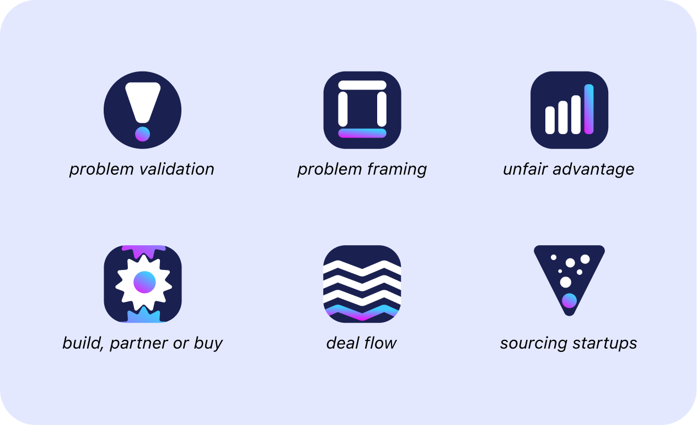

From putting together a design system, thinking about the value proposition and actually getting stuff done, building a product from scratch is hard work! It is also fun and you learn hips.

For me personally this is a very interesting opportunity to learn more about building web applications, digital products and consolidating the things that I have learnt in the past. I could have chosen a bunch of different topics for this project, however decided to put together all the tools and frameworks that can help corporates better engage with the startup ecosystem. 

# Engaging with startups

The idea and concept is very simple. I am building a little corner on the internet where you, or anyone interested, could learn more about the main tools and frameworks to engage with the startup ecosystem.

In my mind the user will be anyone that is working in corporate innovation, an accelerator, venture building agency or even in a VC / PE firm and is keen to refresh their tools and frameworks. They will be able to search and explore tools and frameworks around the different stages of a corporate-startup engagement, from **(1)** discovery, **(2)** validation and building to **(3)** scaling.  

It makes sense to start from the beginning so in the next couple of days I will be working on the Discovery stage. Below you can check the logos created for the first bach of frameworks

Nice! 

At the moment I have started to put together the different components for the project and you will be able to see them [here](https://www.framsup.com/) (expect a more developed web app now). Please bear in mind that (1) I will be documenting the components with story book and that this is my first stab at it. 

Ah... one more thing, my wife doesn't like the color combo... so, that might need to change :).

# Get involved

This is not set in stone and will evolve over time. Despite the fact that I have been doing this for a couple of years I don't claim to be an expert - I actually hate the word **expert**, for me we are all learning. 

Given that, I would like to encourage you to get involved in this fun little project and if feel that I am missing a couple of very important tools, just let me [know here](https://forms.gle/zDusbRKxRuLwJDdP7).
   
Also, if you want to help me build this, feel free to head over to the [project repo](https://github.com/tiagofsanchez/iBuild). 

# Wrapping up

Remember, this is all about the process, putting the work at learning something new and to make sure you are able to retain as much as possible.

As part of the plan, I will be sharing progress on a daily basis [@party-corgi](https://www.partycorgi.com/). Alternatively, if you don't want to miss a thing just sign up for the 
[newsletter](https://tiagofsanchez.ck.page/c6b98eda74), I promise not to spam you and that you can ask me anything you want about my #100DayProject.

Hope to see you around!

