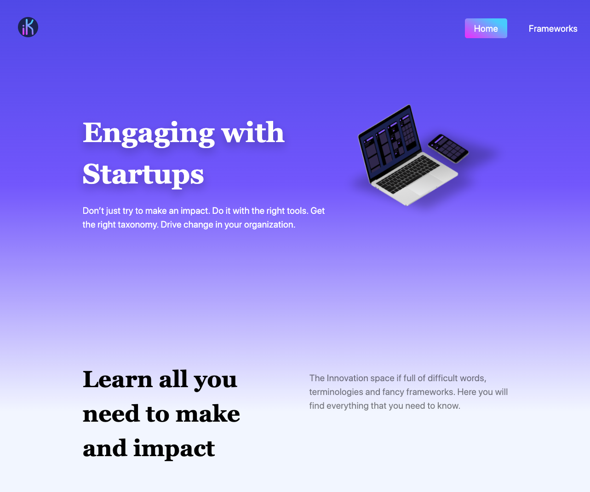

I have been silent. I know, sorry! 

But that doesn't mean that I haven't been pushing through and working behind the scenes on this project. Last couple of weeks I have been focusing on connecting the backend with the frontend so that all the information, now in strapi, could flow to my frontend that is being build with gatsby by pulling data via graphql queries. 

# Launching 🚀 something

No, this is not finished. But that is ok!

You can check the [LIVE](https://ikit.netlify.app/) application if you would like to. 

I decided to launch something, despite the fact what I am launching is not bullet proof. At the end of the day I am trying to gage feedback, understand what others think about the web app that I am building and how could I improve it.

Today is day 39 of my #100DayProject and it has been challenging, however maintaining that consistency of doing something every day has kept me going, slowly, but pushing through. There is something to be said about routine and how it can be super important if you are trying to learn / build something over time. When I first started this side project I wrote a piece about [having a #100DayProject mindset](/blog/2020-08-20-about-having-a-100-day-project-mindset) and the reasons why I was doing this. I reckon those reasons still make sense, well at least for me.

# What you will find 🔎

You will find a simple application, with, hopefully, a pleasant UI, that is designed for people that work in the corporate startup engagement space. The web application will have tools, that I hope, will be interesting for anyone working on that space. 

I don't have a nice name this application, as pretty much all domains that I liked are taken, so at the moment I am using the initial name - [iKit](https://framesup.netlify.app/). iKit, stands for Innovation Kit... yes, I know, a terrible name. We will have to change that. If you have any ideas, do let me know :)

At the moment, I am structuring the information for all different frameworks as follows: 
- Description
- Who could use the framework
- Framework explanation

I reckon this barely grasp the surface and that I should be able to **(a)** design a nice downloadable framework and **(b)** expand the explanation with examples that will illustrate how anyone could effectively use the framework.
 
Well, that is certainly missing and I will push this into my todo list.

# What I am still working 🏋️‍♂️ on 

I would like to split my next couple of weeks into two different threads of work: 
1. Business side
2. Technology considerations

Despite they go hand in hand, it is probably better to explain them separably. 

### From a business perspective

As I mentioned above, I am planning to design and build a downloadable framework that will help anyone that would like to use the framework. On top of that it could be interesting to explain examples, real case examples, on how to use the framework. 

At the moment, if you think about the way we break down the development / engagement phases with startups you will probably have **(1)** Discovery, **(2)** Building and **(3)** Scaling phases. That being valid, the current available frameworks would probably be around the Discovery phase. That means that I still have a lot to do with regards the number of frameworks that we will have in the web app.

### Technology considerations

Here I will also split my considerations into two different buckets: 
- Backend 
- Frontend

#### My backend

On my last post [thinking about my headless cms](/blog/2020-08-20-about-having-a-100-day-project-mindset), I have tried to highlight the reasons why I have chosen strapi for this project. 

I am still pretty happy with their CMS despite the fact that I had a couple of hiccups setting up strapi, given I am using the sqlite version and deploying on heroku.  Personally, strapi potential will come latter, where I am planning to have: 
- A user authentication using both strapi and gatsby
- Collaborator access to the backend 

The user authentication will totally depend on two factors; **(1)** will the users like to have a favorites page, where they could store their favorite frameworks and **(2)** the number of frameworks, diversity of content and number of users. We shall see... but one thing is for sure, I would very much like to learn how to implement that. (I am actually checking this really nice [post](https://hashinteractive.com/blog/gatsby-authentication-with-strapi-io/) for a similar implementation)

With regards to the collaborator access, as soon as I have someone that could help out with the content I will push this into to the top of my todo list.

Last, but not the least, I am super keen to deploy and test strapi using gatsby cloud and to have the real-time CMS previews. Unfortunately the incremental builds are behind a paywall, otherwise I would love to test that.  

#### The frontend

Apart for the normal tweaks that I will need to do, the most critical things are aligned with the content expansion and will entail: 
- Work on the copy and UX messaging
- Hardcoded content to move over to strapi 
- A search page and feature (to make easy for everyone to search the web app) 
- Build a repository of all innovation / venture building agencies
- About page... guess I will need one :)

Oh well, I am far from finished.

# Wrapping up

If have any suggestions around other different frameworks that I should be including here, please do let know. I will drop a [google form here](https://forms.gle/zDusbRKxRuLwJDdP7) to make life easier for anyone that would like to provide feedback. Thank you!

Remember, this is all about the process, putting the work at learning something new and to make sure you are able to retain as much as possible.

As part of the plan, I will be sharing progress on a daily basis [@party-corgi](https://www.partycorgi.com/). Alternatively, if you don't want to miss a thing just sign up for the 
[newsletter](https://tiagofsanchez.ck.page/c6b98eda74), I promise not to spam you and that you can ask me anything you want about my #100DayProject.

Hope to see you around!

