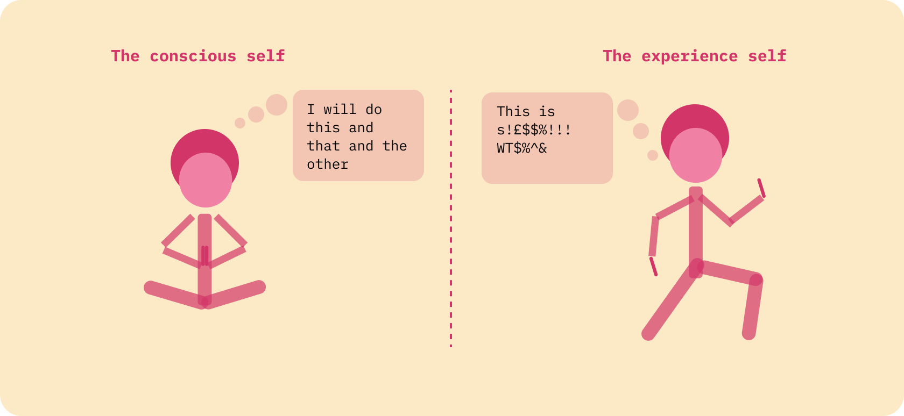
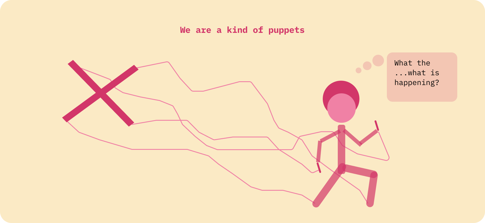
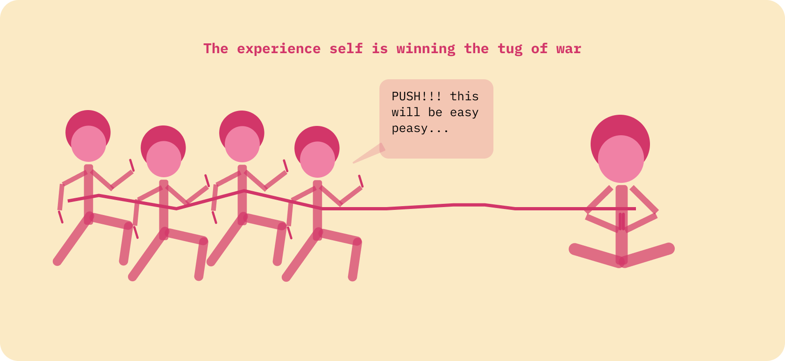
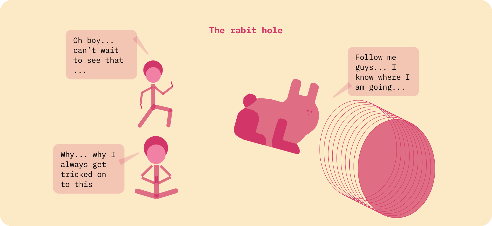

Way before The Social Dilemma aired on Netflix, I knew that if I was using any digital product for free, I was the product. These types of products are designed in a way that our attention is worth money, a lot of money. The documentary explores this dynamic by highlighting so many nuances, problems and challenges that we face daily as we go about living our "digital" lives. 

The societal transformations that we went through as a species are quite unique. People moved from the country into big cities with the introduction of mechanical production. And how people lived and worked, fundamentally changed with the discovery of electricity and mass production. Most recently, the digital revolution has impacted nearly every industry – once again transforming how we live, work, and communicate. 

We have always adapted. Progress has always brought about the betterment of society, and in pretty much all the cycles, those new technological achievements improved our lives. It is hard to argue against the fact that electricity changed the way we use energy, that cars transformed the way we commute, and that TV evolved the way we live at home. 

All past technology advancements have had their pros and cons. But for the most part, the positive aspects clearly outweigh the negative ones. Unfortunately, this might no longer be the case, as technology now has even more influence over the way we think and behave. 

We are now living in the fourth phase of the industrial revolution where the exchange of information between man and machines is so fast, seamless and tailored, that it has created what many call the “attention economy”. 

> The term “attention economy” was coined by psychologist, economist, and Nobel Laureate Herbert A. Simon. He [posited](http://digitalcollections.library.cmu.edu/awweb/awarchive?type=file&item=46997) that attention was the “bottleneck of human thought” that limits both what we can perceive in stimulating environments, and what we can do. He also noted that “a wealth of information creates a poverty of attention,” suggesting that multitasking is a myth (read the Berkeley Economic Review article here). But why should we be worried about all this?  

# We are Humans after all

Our brain, and the way we go on with our lives and make decisions, is simply fascinating. We are extraordinarily complex creatures that, deep inside, are always striving to be and do better, but systematically accept whatever comes our way.

In a very simplistic way, our decision making process is split by our **conscious self** – the things we know we should be doing – and the **experience self** – the pleasure-seeking part of our brain. 

Our **conscious** part of the brain is always trying to push boundaries and overcome challenges by setting up a bunch of plans for us to go through. The irony is that our **experience self** is forced to complete the to do list our **conscious self** designed. Our consciousness exists in our minds, not necessarily in the physical world, whereas the experience self lives in the real world but still must follow the roadmap the conscious self has laid out. 

Given our **experience self** exits in the real world, it owns the vast majority of our decision making process. It is the one that will need to go through the pain of a diet and train for a marathon. Whereas, the conscious self tends to be dormant most of the year – typically appearing in time for the classic new year's resolution. Our **conscious self** is very well intentioned – it cares for you – but the burden of this newly created plan falls on the experienced self. As a result, our experience self is well aware of the nice shot of dopamine and serotonin when seeking satisfaction, creating an important compensation feedback loop that guide most of our actions.

This dynamic is not new, so why is there so much fuss about this? Well, mostly because your experience self is getting a LOT of help by the winners of the "attention economy". In short, technology is doing a fantastic job exploiting our dopamine and serotonin chemical addition.   

# We can be hacked

Most of us think that we are free, that we completely in control our decisions and that we have a mind of our own. But what if that is not true? What if we are actually nothing more than a bunch of hackable beings that, in a way, are prone to being programmed by a third party entity? Well, it might not be the case yet, but I reckon we are getting closer to it than we think. Everyday we wake up and go about our lives believing we are in total control of our choices, however reality is that we can be manipulated more often than not.

Before we go through that hypothesis, let's try to understand how irrational human beings are. Yes, we can be irrational as a species, even when facing facts that should push us to act and behave differently. This can actually be a little bit harsh, so let me put it a different way: 

Our conscious self lives in total logic and makes the most interesting and rational connections. However, our behavior, driven by our experience self, is mostly steered by our chemical addiction to dopamine. Most of the time, we behave irrationally – even when we think rationally.

Surely you have met a smoker that will tell you he can quit anytime he wants to. He will know about the health implications of his decision, yet he still smokes around 10 to 20 times a day. The smoker acknowledges the very possibility of premature death and as a result, his mind – in this case it’s his experience self – tricks his conscious self to believe that he will quit tomorrow. Tomorrow comes, he continues to smoke, and his experience self repeats the same behavior. He genuinely wants to quit, however all people around him smoke. He goes to any public place and sees people smoking – the world around him makes smoking a norm, everyone does it. As a result, it is very hard for him to quit. 

In his book the [Ego and Its Defenses](https://books.google.com.sg/books/about/The_Ego_and_Its_Defenses.html?id=qD59AAAAMAAJ&redir_esc=y), by Henry Prather Laughlin, you can find so many different examples of irrationality, or has the author put it, ego defenses.

The smoking case is interesting because society reacted, regulators designed laws to curb the number of smokers and, in a way, are trying to pass the message that smoking is not the norm and you are not allowed to smoke in public places. As a result, a smoker is the outlier in this equation and eventually feels less inclined to continue smoking. The smoking battle is not won, but is a good case for the need of external intervention – even when we already know the terrible implications of smoking. 

Now imagine this – your cigarette package is designed to be smart. It is what we would call a "smart cigarette package", with all cigarettes connected and able to predict and nudge you to smoke whenever it aligns with your intrinsic motivations. The smart cigarettes are connected to your smartwatch and can read your heart rate and anxiety levels to predict exactly when to nudge you. Your package vibrates, you get a notification on your wrist, and off you go to pick up that puff. From a technology perspective, this is possible. From a business standpoint, this aligns to the business model of the tobacco industry as it’s designed to increase consumption and ignore the addiction problem – we can be hacked.

# Our experience self as a lot of help

Technology is using their power and their ability to learn from you at every single interaction you have with the online world. By tracking and storing millions of data points on you, they can design great products that are optimized to increase usage, predict your behavior and better understand what to serve you next. Your experience self is getting a lot of help.

No one describes this better than Tristan Harris. In Social Dilemma, he illustrates how computers and algorithms can learn from the millions of interactions they have with humans and can predict our next move so that their recommendation prompts us to take an action. Harris describes YouTube as being designed to keep us engaged ‘no matter what’. As far as I know, YouTube is surely succeeding at predicting by behaviour, as on numerous occasions, I have found myself spending three or more hours binge-watching stuff on their platform.

My conscious self is aware I should stop this ridiculous behavior and get on with more interesting things, but my experience self keeps pulling me to the screen. The YouTube machine gives my experience self the ammunition needed to push my conscious self out of the way. More often than not, I spend more time than I wanted.

It is not all doom and gloom. YouTube is still a fantastic source of knowledge, and the majority of things that I have learnt about coding are thanks to YouTube. The platform is also responsible for the creation of amazing new businesses that wouldn't exist otherwise. 
However, YouTube does have a lot of power in influencing what we click next and, unfortunately, will always try to cater for the needs of our experience self. 

For me, this is the problem. Not only with YouTube, but with all products that have a free business model and are totally dependent on the amount of time users spend there.

In a different example (that Tristan explains in a conversation with Youval Harari, ironically
on YouTube), think about a teenager going through some sort of a crisis about her body. She goes online to search for dietary recommendations as she is trying to lose weight. The Google search machine does its thing and retrieves a nice YouTube video that the teenager watches. Next on the recommendation playlist is a new video featuring anorexia – because it has more likes, views, engagements, and higher probability to click. Personally, I believe I know someone that unfortunately ended up with eating disorders because of this behavior.

It is extremely hard for a video to surface in the recommendation engine of YouTube, for that to happen, the video needs a lot of likes, shares and views. In theory, only views from human beings should be driving those numbers up, but with the growing popularity of services selling paid views from bot farms, that might not be the case.

# The free will fallacy and the rabbit hole

What if you could totally control your experience self and nothing from outside could influence the way you think? Let's say that this is true and that you have an absolutely amazing self control capability.  

What happens if all the people around you don't have the same level of self control? What if they are always falling prey to the "join the club" mindset? What if algorithms work so efficiently that can always lure society into the type of content that gives them that dopamine hit? What if a teenager starts an eating disorder just by searching dietary trends on YouTube and getting sucked into the anorexia rabbit hole? What if we started to have people that believed that the world is flat because they saw that on Facebook? How would you feel if your kid saw another teenager streaming their suicide online – reinforcing the idea and concept that suicide is a normal thing to do? 

We are facing a problem with so many levels of complexity that it is becoming increasingly more difficult to tackle. Firstly, we typically think that, similar to smoking, we can quit social media anytime we want. Sometimes it is worse – we think that nothing is able to steer our rational and conscious self from deciding what we really want. We think that we have free will and that whatever we do and decide is a product of our minds.

Unfortunately, we fail to recognize the high-level problem. The vast majority of people – politicians, regulators, white and blue collar workers, and society in general – don't recognize that their time and attention is more valuable to the tech industry when their engaged in an endless scroll of online news feeds. We are all more valuable with our face stuck in ceramic screens than trying to live our lives, cure cancer or solve any problem around our society. Moreover, the smartest people on the planet are actually working for big tech and not necessarily solving humanity's biggest challenges. 

I completely respect and admire people that are able to control their experience self, don't get influenced by externalities and can completely master their free will. Unfortunately, I don't believe I have met one yet. 

# What is next for us

Let’s face it, there are a couple of problems here. 

For starters, the power that technology has in being able to persuade us to take action in a programmatic way and at scale. Back in the day, society had similar comments about TV, newspapers and any other form of media as their business model totally depended on getting people's attention. While these attention-grabbing mechanisms didn’t track, gather and store every single interaction of our behavior, they probably would have if given the opportunity. Moreover, they were designed and performed by humans, not machines. And as a result, a Newspaper has an experience designed for many users whereas your digital experience is tailored just for you. Imagine if the Times launched millions of different magazines depending on the users beliefs? That is what is happening today in our digital “attention economy” and it’s making us lose sense of what is true or not.

On the other hand, any algorithm lacks a sense of morality. It is not ok to push an anorexia video to a teenager with a potential eating disorder. In our eyes, that is terrible. However, the algorithm is only doing it’s job by maximizing the click-through-rate of any recommended video. For the machine to recommend the video, it will need to have information about the users, as well as a video with a lot of views, shares and comments. What is also worrying is that there are numerous companies selling views, shares and comments by bot farms and are able to surface videos that aren’t necessarily aligned with morality either.
  
I don't pretend to have a clear solution for this problem, but I am concerned with how this digital world is shaping up. More than anything, I am concerned with the fact that most of the time we dismiss this as a problem. 

This is a problem. A very big problem.

The reason we probably don’t have a smart cigarette connected to our smart watch that tries to increase the user's cigarette consumption is because there are laws against that. Regulators have pushed anti-smoking laws to drive a positive result on public health. Similarly, given that our attention is being pulled by morality-free machines that create a distortion of the truth, regulators should be more involved in designing a digital ecosystem that is more useful at an individual level so that we have a better collective society.  

