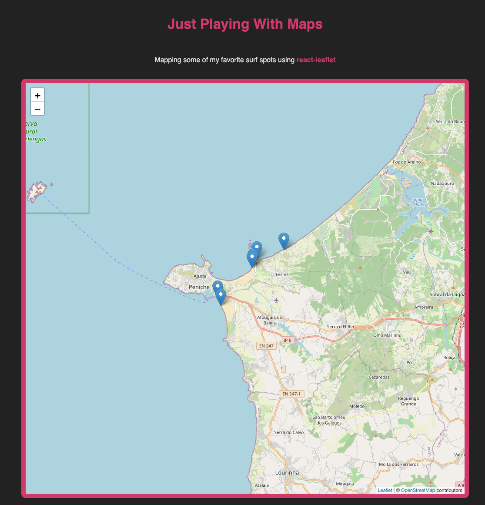

import { Box } from "theme-ui";

I always wanted to learn how to create applications that use maps and today was the day that I decided to build a small little app with a map with some of my favorite surf spots.



If you want to check out the app click on the [link](https://tiago-surfspots.netlify.app/).

You also can check the project [repo](https://github.com/tiagofsanchez/surfspots) if you would like to test the source code.

# Turning google sheets into an API

First things first.

I wanted to use something very simple to store my favorite surf spots and decided to go with google sheets as I also wanted to learn how could I be using sheets as an API endpoint. It turns out that is pretty easy to do that. You would need to:

1. Populate sheets with the information that you want to
2. Turn your sheet public and get that link
3. On your link get the sheet ID
4. Use this link with your sheet ID

<Box sx={{ p: 2, bg: `hover`, wordBreak:`break-all` }}>
  https://spreadsheets.google.com/feeds/list/YOUR_SHEET_ID/1/public/full?alt=json
</Box>

And boom, you will now have an API that you can get your data from. Just check the [API endpoint](https://spreadsheets.google.com/feeds/list/1Dk1KD6ldix8ZEMJNa4evmrl2MJeFM5g6g9Cxis-oPjc/1/public/full?alt=json) possible to use on the back of google sheets.

# Let's use react-query

Or should I say, goodbye `useEffect`.

This simple library that enables you to fetch your data without needing `useState` to store your data, neither `useEffect` to manage the side effect of getting that data depending on the component life cycle.

You can do a lot of different things with `react-query`, some of them it is still way above my head, but I really liked the easy way that library works as you will need to write less code while getting a better performance. A clear win.

If you want to know more about the `react-query` check out the following video with Jason and Tanner.

<YouTube youTubeId="DocXo3gqGdI" />

# Building a map

Ok, now we are ready to go and build our map.

The first thing that we need to do is to get our data into our component.

```jsx:title=src/components/surfSpotMap.js
import React from "react";
import { useQuery } from "react-query";
import axios from "axios";

const url ="https://spreadsheets.google.com/feeds/list/1Dk1KD6ldix8ZEMJNa4evmrl2MJeFM5g6g9Cxis-oPjc/1/public/full?alt=json";

const fetcher = () => axios.get(url).then((res) => res.data);

const useSpots = () => {
  return useQuery("spots", () => fetcher());
};

const SurfSpotMaps = () => {
  const surfSpots = useSpots();

  return (
    <div>
    MAP WILL BE HERE
    </div>
  )
}

return default SurfSpotMaps
```

Above we now have access to the our google sheet data and as a result to my favority surf spots! Nice! We now need to do a couple of different things:

- Add a Map
- Push data to the map

```jsx:title=src/components/surfSpotMap.js {2,19-39}
import React from "react";
import { Map, Marker, TileLayer } from "react-leaflet";
import { useQuery } from "react-query";
import axios from "axios";

const url ="https://spreadsheets.google.com/feeds/list/1Dk1KD6ldix8ZEMJNa4evmrl2MJeFM5g6g9Cxis-oPjc/1/public/full?alt=json";

const fetcher = () => axios.get(url).then((res) => res.data);

const useSpots = () => {
  return useQuery("spots", () => fetcher());
};

const SurfSpotMaps = () => {
  const surfSpots = useSpots();

  return (
    <div>
      {surfSpots.isLoading ?
        (<span>Loading...</span>)
       : (
        <Map center={[39.3558, -9.345]} zoom={12}>
          <TileLayer
            url="https://{s}.tile.openstreetmap.org/{z}/{x}/{y}.png"
            attribution='&copy; <a href="http://osm.org/copyright">OpenStreetMap</a> contributors'
          />

          {surfSpots.data.feed.entry.map((spot) => {
            return (
              <Marker
                opacity={10}
                key={spot.gsx$name.$t}
                position={[spot.gsx$la.$t, spot.gsx$lon.$t]}
                onClick={() => setActiveSpot(spot)}
              ></Marker>
            );
          })}
          </Map>
          )}
    </div>
  )
}

return default SurfSpotMaps
```

Here what we are doing is using `<Map />`, `<Marker />` and `<TileLayer />` to be able to render a map marking my favorite surf spots. Given that I aslo wanted to show the the name of the different spots, let's go and create that by adding the `<Popup />` from the lybrary.

```jsx:title=src/components/surfSpotMap.js {2,16,40-49}
import React from "react";
import { Map, Marker, TileLayer, Popup } from "react-leaflet";
import { useQuery } from "react-query";
import axios from "axios";

const url ="https://spreadsheets.google.com/feeds/list/1Dk1KD6ldix8ZEMJNa4evmrl2MJeFM5g6g9Cxis-oPjc/1/public/full?alt=json";

const fetcher = () => axios.get(url).then((res) => res.data);

const useSpots = () => {
  return useQuery("spots", () => fetcher());
};

const SurfSpotMaps = () => {
  const surfSpots = useSpots();
  const [activeSpot, setActiveSpot] = React.useState(null);

  return (
    <div>
      {surfSpots.isLoading ?
        (<span>Loading...</span>)
       : (
        <Map center={[39.3558, -9.345]} zoom={12}>
          <TileLayer
            url="https://{s}.tile.openstreetmap.org/{z}/{x}/{y}.png"
            attribution='&copy; <a href="http://osm.org/copyright">OpenStreetMap</a> contributors'
          />

          {surfSpots.data.feed.entry.map((spot) => {
            return (
              <Marker
                opacity={10}
                key={spot.gsx$name.$t}
                position={[spot.gsx$la.$t, spot.gsx$lon.$t]}
                onClick={() => setActiveSpot(spot)}
              ></Marker>
            );
          })}

          {activeSpot && (
            <Popup
              position={[activeSpot.gsx$la.$t, activeSpot.gsx$lon.$t]}
              onClose={() => setActiveSpot(null)}
            >
              <div>
                <h1>{activeSpot.gsx$name.$t}</h1>
              </div>
            </Popup>
          )}

          </Map>
          )}
    </div>
  )
}

return default SurfSpotMaps
```

And there you go! Now, you can check some of my favorite surf spots and the place where I came from :). If you want to check out the app click on the [link](https://tiago-surfspots.netlify.app/).

# Other stuff

Here you will also find a bunch of different resources that also could be helpful.

- If you want to know more about maps, check out this [inspiring talk by Colby](https://www.youtube.com/watch?v=dBHUir4I13c&t).
- To learn more about `react-query` check out this [good tutorial](https://www.youtube.com/watch?v=x1rQ61otgtU) from The Net Ninja.
- In case you would like a easy way in to `react-leaflet` check out this [video](https://www.youtube.com/watch?v=290VgjkLong&t).
