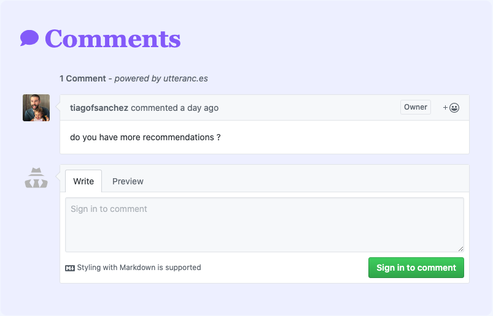

I have played with the idea of implementing comments on some of my projects, including this blog, for a while, however I have never done it, until I found [Utterances](https://utteranc.es/).

Gatsby proposes a couple of [different options](https://www.gatsbyjs.com/docs/adding-comments/), from Disqus to Facebook Comments as well as other different options, but generally they fell like they don't belong to your web app or they are running ads and targeting users, so I never really put to much effort into it.

# Utterances comments

[Jeremy Danyow](https://github.com/jdanyow) did a fantastic job with setting this up, it is absolutely amazing how easy it is to set up Utterances and have a comment section that works like a charm in your project. 

As per the project documentation: 

> A lightweight comments widget built on GitHub issues. Use GitHub issues for blog comments, wiki pages and more!

At the end of the day, this is and open project that takes care of everything for you, doesn't blast you and your users with ads and you can keep all the data in a GitHub repo of your choosing. 

Needles to say that this is fantastic for a lot of the things that I am trying to do, like 👉 implementing comments to [Framsup](https://www.framsup.com/).

# Setting up Utterances with Gatsby

I reckon in a normal webpage this will be slightly simpler to implement than in Gatsby or in any React application as you will need to find a way to dynamically use the script that Utterances build and repurposed a useEffect hook to manage the side effect needed to "get and push" the comments from a given GitHub repo. 

In short this is what you need to do: 
- Create a new repo (bear in mind that the comments will be stored in this repo and it needs to be public)
- Install the [Utterances app](https://github.com/apps/utterances) in the repo you just created
- You need to choose the mapping between blog post and the GitHub issues
- Create a `<Comments />` component on your React project
- Implement your Comment component in the pages that you would like

The first 3 steps are straightforward and very well explained in Utterances [documentation](https://utteranc.es/), so I will skip that piece. 


The Comment component will be as follows:

```jsx:title=Comment.js
import React from "react";

const Comment = ({ commentBox }) => (
  <div ref={commentBox} className="comments"></div>
);

export default Comment;
```

Like this we will be able to set up the script that will be referring to this div on the page component where we would like to comment to be implemented.

On the page that we want to implement the comment we will need to run the script on the useEffect hook as follows

```jsx:title=Framework.js
...
  useEffect(() => {
    const commentScript = document.createElement("script");
    commentScript.async = true;
    commentScript.src = "https://utteranc.es/client.js";
    commentScript.setAttribute("repo", "tiagofsanchez/iBuild-comments"); // PLEASE CHANGE THIS TO YOUR REPO
    commentScript.setAttribute("issue-term", "pathname");
    commentScript.setAttribute("id", "utterances");
    commentScript.setAttribute("theme", "github-light");
    commentScript.setAttribute("crossorigin", "anonymous");
    if (commentBox && commentBox.current) {
      commentBox.current.appendChild(commentScript);
    } else {
      console.log(`Error adding utterances comments on: ${commentBox}`);
    }
  }, [commentBox]);
...  
```

Do notice that all the options that are selected can be changed as per Utterances [documentation](https://utteranc.es/).

# Utterances in action 

And that is it, you can now implement the Utterances project on tour React project in order to achieve the following: 



That is it! Simple and effective. If you want to check out this real time head over to [Framsup](https://www.framsup.com/) and check one of the frameworks that we have there. 

Hope this was helpful. 