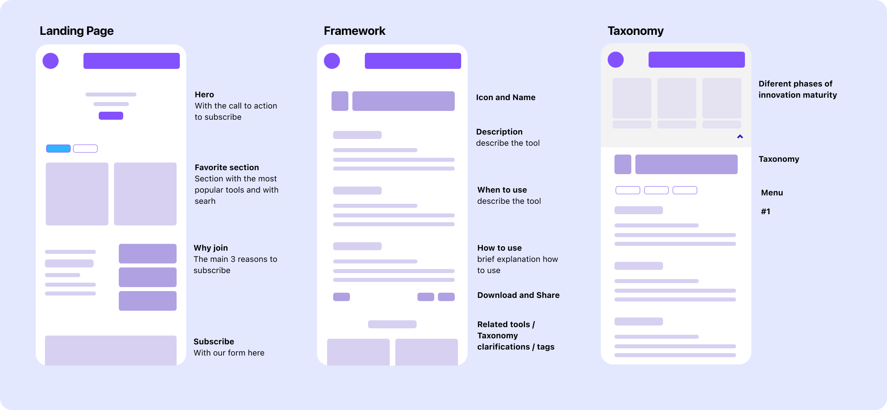

import GardenStats2020 from "../../src/components/content/gardenStats2020"

This year - 2020 - was a very strange one and for the vast majority of people it was very a challenging time. Countries embraced lockdown, families weren't allowed to get together, many lost their loved ones and the world seems to be more divided than before despite all technological advancements. 

I also had my ups and downs, with a very nice start of the year that followed by a couple of not so pleasant experiences but ended on a very nice note.

# 💃 Finalized my Udacity react nanodegree

After a couple of months trying to learn react by myself, I decided to take a different approach and started Udacity React Nanodegree. I have to say that it was a very positive experience, however it was far from perfect as I described in [Udacity React Nd, the good, the bad and the ugly](/blog/2020-03-05-udacity-reactnd-the-good-the-bad-and-the-ugly/), but for me given my level at the time, it was perfect.  

Despite all the challenges with the program I enjoyed the combination between “code along” projects and “real life” code situations, it was balanced and really good for someone that is learning a new coding language (or coding in general for that matter). In short it is fair to say that you will be learning by doing - this was what I liked the most about the program!

If you want to learn more about it and check the projects that I build on the program feel free to check the above 👆 post. 

# ✈ We were lucky enough to travel

For obvious reasons I do have to mention this: we managed to travel for holidays in 2020 and despite the fact it now feels like this was ages ago, we were super lucky with our little trip to Bohol, in the Philippines. 

We manage to snorkel with the kids, got sunburned, ate great food and travel through Bohol in a tricycle motorbike. It was fantastic, back then something normal to us, now so foreigner that I don't remember a world where we can travel anymore. 

I can't even grasp all the challenges that all those beautiful people we meet along the way are going through without tourism? The lack of healthcare infrastructure was also visible as we literally where in the middle of nowhere - I only hope that they are all fine.                                                                                        

                      

# 🦠 Covid started to take over the world

We landed back in Singapore to a completely different reality: Covid-19 was here, it was a reality the moment it started to take people's lives away, changing the way we socialize and imposing fear on the world. Back then I had no idea that this would last so long, that our living room would be our kid's school, our office, our clinic, our cinema, our everything. 

For the few lucky ones (I consider myself a lucky one) this will be the new reality for the foreseeable future, for the not so lucky ones, the ones that can't afford staying at home the new reality probably means that they would be living in constant fear as they have to hit the streets to go to work. For naysayers this will probably mean that they will take Twitter, Facebook or any other social media to voice their opinions and disbelieves. 

The world has changed and will not be the same anymore irrespective of what we believe and think.

On the back of going through all this, I decided to put my web dev learnings to good use and build [crushingwfh](https://crushingwfh.com/), a simple repository with tools that can help anyone to better work from home.  I also started to obsess a bit with the Covid-19 numbers and as a result of that begun to volunteer for [the covid tracking project](https://covidtracking.com/) were I was helping with building and maintaining their website.  

# 💀 Got made redundant

A strange email crept in my calendar, it was from HR. I though it was strange and could see that all my colleagues were in the same invite. In a couple of hours we were all in the same call with the company CEO and HR - this was not a good sign.  

We were all made redundant.  

It felt strange, good, bad and then strange again. I thought all sorts of things. I had been living in Singapore for more than 7 years now and in a way it felt that the runway ended abruptly. At that moment, working from our living room whilst trying to homeschool our kids it felt bad and then good. 

We were at home 24/7 and the word **family** gained a very different meaning - for me, clearly for the best.

# 💍 Got married after 12 years living in sin

It is pretty much impossible to stay in Singapore without a job as foreigners are required to have a working visa (employment pass) to stay in the country, I was therefore in a very strange situation given that I found myself without a job. To work my way into a legal situation again I needed to (1) get a job or (2) piggy back on my better half EP.

It was time to propose :)

I must confess that it was not the most romantic way, but it was a fantastic day. It was not supposed to be like this but normally life has different plans for you. And you know, you have to love the serendipitous of life and just hold on to every amazing opportunity that life throws at you. For us, for me, life had it so that we were meant to get married. And it was absolutely amazing!

I wrote a small [post about our special day](/blog/2020-07-16-today-is-a-special-day/).

# 💻 Started my #100DayProject

I have a terrible memory and pretty much like Dory, I forget everything new that I learn. The psychologist **Herman Eddinghaus** was one of the first people to study the 24hr memory drainage and the fact that we forget pretty much 2/3 of what we learn in 24 hours. 

This was shocking to me as this basically means that we all are wasting our time with something that will not stick in our minds. However, **Eddinghaus** also offers some advice on how to fight this memory drainage: 
- Repeated learning sessions over a longer interval improve memory retention of a subject;
- Topics at the beginning and the end of a session are most easily to be remembered;
- Any material that is studied beyond mastery is remembered longer.

In short, this was my motivation to start my #100DayProject as I wanted to learn more about web development and didn't want to forget about everything. (if you want to read more about this you can [check the post](/blog/2020-08-20-about-having-a-100-day-project-mindset/) where I explain a little bit more on that) - 
[Framusp](https://www.framsup.com/) was the project born of this experiment and I have to confess that I a pretty happy with all the things I learned on the back of that. 

I hope that I can retain some of it.

# 👊 Got a new job

After thousands of emails ( not kidding, I sent out thousands of emails), numerous calls, and CV tweaks I got a job. It was hard work, a lot of network, patience and luck. 

The process of finding a job in the middle of a heath crisis that is directly impacting the economy and, as a result, the job market, is taxing and hard. After going through this I have learned a thing or two and felt compelled to share it here.

The first thing that I realized is that, generally speaking, though with a couple of exceptions, people are genuinely helpful. Whenever I reached out to friends, they where very responsive and always tried to help out in any way of form. Most of the time a new touchpoint could generate 2 to 3 more leads. Needless to say that this network effect was critical to get a new opportunity. 

I am still amazed by how different the hiring process can be. On one side of the spectrum, you can find smaller and nimble companies that move fast, understand what they want, are willing to compromise and move on. On the other hand, you can find big MNCs that require different rounds of interviews with 2 or more case studies, a hiring process of about 3 months and then don't get back to you with proper feedback after the grueling process. A word to a few of them - that is just rude and now more than ever your candidates need more support, fewer business cases and interviews and more transparency and empathy around the process. Simpling turning down candidates over email after a lengthy process is not sufficient and it reflects poorly on you.

The overall uncertainty is affecting everyone, recruiters and head hunters are no different and their clients, the ones that are being affected by the economical situation, are no longer engaging them for new hires as they need to manage costs. Despite all I was amazed by how helpful most of the recruiters were, to them a bit thank you. 

While reaching out to my network (basically asking for a quick call) I got a very interesting reply by a "friend" saying that 1hr of their time would cost me 500USD. Needless to say that I was not impressed and think the ask, despite legit, is utter nonsense, disrespectful and exploitative of the situation. Asking for 500USD for a call when you mentioned you were made redundant seems a bit out of touch with reality. Be careful with self-proclaimed entrepreneurs that you might have on your network. A word to my "friend": if you're reading this rest assure that I am more than happy to help you if you ever find yourself in a similar situation...and by the way it will be **free of charge**.  

Last but not the least, I seriously think that despite all, the luck factor is often underrated throughout a job-hunting process and if you are currently looking the one thing I would recommend you to do is to connect with all the people that you know and don't know as a way to increase your network and improve you luck variable. 

Ah before I forget, I am currently working for [SingSaver](https://www.singsaver.com.sg/) as Senior Product and Partnership Manager, stocked about this and looking forward to what I will be doing!

# 👨‍👨‍👧‍👦 The kiddos are growing fast (and we don't even notice)

As any parent will attest to, their kids grow fast... like super fast and we don't even notice. This year even though we were together 24/7 it was no different. If anything, I reckon that accentuated the feeling mostly because we were with them all day long whilst we jumped from one call to another. And then we stopped, it was Christmas and the Year was coming to an end. The weeks were blended with the weekends and then the months felt pretty much the same.

The attention economy and all the business built around the principle were clear winners as digital engagement went through the roofs and we seemed to have lost the ability to be here and now, often with our kids, family and friends. The way that these things are designed and the way humans are hardwired doesn't necessarily help us and at the end of the day it make us easier to be hacked and manipulated - I expand on this topic on the post [The most important problem of our times](/blog/2020-10-12-the-most-important-problem/)      

For me, I wish less endless scrolling, less phone screen time and more here and now. It seems trivial, however challenging to achieve. 

# ✍ Got into the habit of writing

This year was a different year and despite the challenges I was able to do so many different things. However, I must confess that getting into the habit of writing and posting with a certain frequency was something that I never expected to do. But I did, partly because I was able to measure it on the back of the dashboard that I have built for my digital garden.

<GardenStats2020 />

If you are keen, you can check the complete [dasboard here](/dashboard).

However, this is more than a numbers game. What I came to realize is that by doing so I am organizing my thoughts and exploring ideas that I wouldn't otherwise. As I mention in my post [you should have a digital garden](/blog/2020-07-06-you-should-have-a-digital-garden/) the idea of engaging in the creative process of writing something, no matter the level of quality, can eventually lead to something bigger.

This is why this blog post is important. Even if no one but me reads it, I am organizing my thoughts, reflecting on what I have done and learned. 

# 🥇 We made it live to 2021 

Yes, we made it to 2021 and in this case we should all be happy. I guess. And we are, there is a positiveness to it, a good feeling with starting something new, the turning of the page in a new book. You feel excited, looking forward to the next chapter. And for most of us that could be true, but we are not all working in the knowledge economy. 

It is, however, a misleading cliche to think that this situation and what happened will treat everyone equally. Though most people complain, being able to work from home is a luxury that only a few have. If you start to peel back the layers on reality you will find that covid-19 has not only put a magnifying glass on inequality but also is entrenching inequalities further and unfortunately it will take time to repair the damage of 2020.

Personally I am happy that we made it through, but conscious that we have to do better next year.

