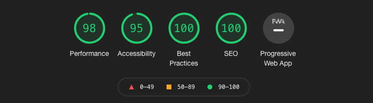

I have been building my digital garden over the past year and recently have been moving this under a gatsby-theme. In this case 2 gatsby-themes. 

- For my data I have -> [gatsby-theme-acmeblog-data](https://www.npmjs.com/package/gatsby-theme-acmeblog-data)
- For my style I have -> [gatsby-theme-tfs](https://www.npmjs.com/package/gatsby-theme-tfs)

And the content is all kept in my current [git repository](https://github.com/tiagofsanchez/tiagofsanchez) while using Netlify as my CDN.  

This separation of concerns makes sense for me. When I am writing something I am doing it in `md` or `mdx`, I keep everything in one place with very limited code and styling considerations. In short I am trying to keep code distractions to the minimum only to consider them when I need to create richer components and render them in `mdx`. 

If you want to set up your digital garden with this theme the easiest way to do it will probably be by using the gatsby starter that I created with `gatsby-theme-tfs`: 

```
gatsby new digital-garden https://github.com/tiagofsanchez/gatsby-tfs-theme-starter
```

After doing that you will need to go in your newly created folder and run `gatsby develop`.

Check the [LIVE](https://gatsby-tfs-theme-starter.netlify.app/) project.  

Needles to say that that you will get a very good performance of the shelf with `gatsby-theme-fts`



> Please note that I am still working to fix the performance and accessibility issues in order to get all signals at 100.  

You can keep reading through if you want more details about the theme or simply explore the starter on your own machine to better understand the features and file structure. 


# 💅 gatsby-theme-tfs features

This is feature rich gatsby-theme and you under the hood you will find: 
- MD and MDX 
- Light Mode / Dark Mode 
- Nice Typography (IBM Typography)
- Tags and Categories support
- Code highlighting with [prism-react-renderer](https://www.npmjs.com/package/prism-react-renderer)
- React live support with [react-live](https://github.com/FormidableLabs/react-live)
- SEO (Sitemap, OpenGraph tags)
- Sound on a couple of buttons with [use-sound](https://github.com/joshwcomeau/use-sound)
- A dashboard with your writing stats
- Ah, not to mention that it is responsive


# 🎨 The options for your theme

There is a considerable amount of things for you to consider. Bellow you can check your options: 

| key      |  default value| 
|----------|-------------|
|`blogPath`|  `/blog` | 
|`postsContentPath`| `content/posts`   |  
|`postsContentThumbnail` | `content/thumbnails` |   
|`pagesContentPath`| `content/pages`| 
|`otherImagesContentPath`| `content/images` | 
|`tagsPath`| `/tags`|
|`categoryPath`|`/category` |
|`postTableOfContents`|`false`|
|`gardenStartYear`| `2019`|
|` githubUrl` | ``|

Despite the fact of being a very opinionated theme, I am still trying to allow users to have a certain degree of flexibility. I would say there are three types of options: 

1. In the url options the user can select the urls, e.g. `blogPath`, `tagsPath` and `categoryPath` that will be programmatically generated;
2. The folder options the user will define how to organize the content, e.g. `postsContentPath`, `postsContentThumbnail`, `pagesContentPath` and `otherImagesContentPath` into folders that will be automatically generated;
3. We also have UI options where the user can choose to have a table of contents and the year where the user started his / her digital garden, e.g. `postTableOfContents` and `gardenStartYear`.

In `gatsby-config.js` you will be able to define the options that you want for your theme, however this options are not mandatory as I considered the default values that I am currently using. 

Having said that you could use the following.

```js
module.exports = { 
  plugins: [
    {
      resolve: "gatsby-theme-tfs",
      options: { 
        blogPath: "/anything", // the default will be /blog
        tagsPath: "/mytags", // the default will be /tags
        categoryPath: "/mycategory", // the default will be /category
        postsContentPath: "myblog/posts", // the default will be content/posts
        pagesContentPath: "myblog/pages", // the default will be content/pages
        otherImagesContentPath: "mysuperimages", // the default will be images
        githubUrl: "your repo url so that users can edit it",
        postTableOfContents: true //the default is false
        gardenStartYear: 2021 // the default will be 2019
      }
    },
  ],
};

```

# 🚀 Using gatsby-theme-tfs

If you were to start from an empty folder you will need to start with 2 things: 

- The `package.json` file 
- And the `gatsby-config.js` file

Ok, now you can open your code editor and create those 2 files. Let's start with the first one.

```json:title=package.json {8}
{
  "name": "tfs",
  "author": "Tiago Sanchez",
  "main": "index.mdx",
  "license": "MIT",
  "dependencies": {
    "gatsby": "^2.31.1",
    "gatsby-theme-tfs": "^2.0.10",
    "react": "^16.4.0",
    "react-dom": "^16.4.0"
  },
  "scripts": {
    "develop": "gatsby develop",
    "clean": "gatsby clean",
    "build": "gatsby build",
    "serve": "gatsby serve"
  }
}
```

Please feel free to change the first properties of `json` file as you see fit. Now let's move to the `gatsby-config` file

```js:title=gatsby-config.js {22-29}
module.exports = {
  siteMetadata: {
    siteTitle: `tiagofsanchez`,
    siteTitleAlt: `Simple Blog - gatsby-theme-tfs`,
    siteHeadline: `Simple Blog - Gatsby Theme from tiagofsanchez`,
    siteUrl: `https://www.tiagofsanchez.com/`,
    siteDescription: ` Learning tech, writing about it and putting ✒️'pen to paper' on stuff that I like to do and think about!`,
    siteLanguage: `en`,
    siteImage: `./images/logo.png`,
    author: `tiagofsanchez`,
    navigation: [
      {
        title: `Me`,
        slug: `/about`,
      },
      {
        title: `Articles`,
        slug: `/blog`,
      },
    ],
  },
  plugins: [
    {
      resolve: "gatsby-theme-tfs",
      options: {
        githubUrl: "https://github.com/tiagofsanchez/tiagofsanchez/blob/master/", 
      },
    },
  ],
};
```

Despite the fact that I am only highlighting the plugin part it is important to note that, at the moment, and considering the way I have designed the navigation on this theme we will have to explicitly define those in `siteMetadata`. Also important to note that the respective slugs will need to be the same as the ones in the options of the plugin and / or the names of the pages that will be created on the folder structure.

After creating those files you can now just run `yarn` on your cli to install all your packages and dependencies and you should be ready to go. 

You now have 2 options; you can run `gatsby develop` to trigger the creation of the folder structure as per the options that we set up or we can manually create those folders. If we run the command we will see a couple of errors as none of the folders will have content in it and the graphql queries will not work properly. 

I am lazy so I will always run the command and that will result on the following folder structure that we set up as defaults. 

```
ProjectName
├── content
│   ├── images
│   ├── pages
│   ├── posts
│   ├── thumbnails
```

There will be a catch: given that we don't have the content in those folders you will receive a couple error messages on your terminal. 

# 📒 Adding content to your project 

There are a couple of things you will need to do for your project to work:
- To add a logo on the hero you will need to add a `logo.png` in to the images folder
- Add a `about.mdx` (if you set it up as that on the `siteMetadata` as about) to the pages folder
- Create a couple of posts into the posts folder (they can be `md` or `mdx`)
- The thumbnails for is exactly for that, provided that you point the post to a thumbnail png
   
When you are putting together your post - in `md` or `mdx` - you will need to structure the first part to the content as follows: 

```md:title=PostStructure
---
title: "My digital garden as a gatsby theme: gatsby-theme-tfs"
date: 2021-01-25
category: "Code"
thumbnail: "../thumbnails/logo.png"
tags:
  - gatsby-theme-tfs
  - gatsby
  - theme
selected: "no"
---

```

Bear in mind that `category` and `tags` will create the different categories and tags of posts that you will write about, the `thumbnail` will point to the illustration you want your post to have in the header of the post and if you choose `selected`: yes you will have that post in the featured section of your home page.  

Hope this is useful. 

