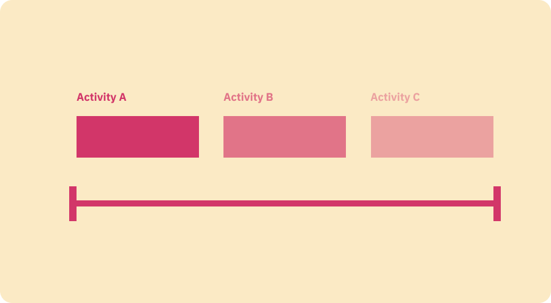
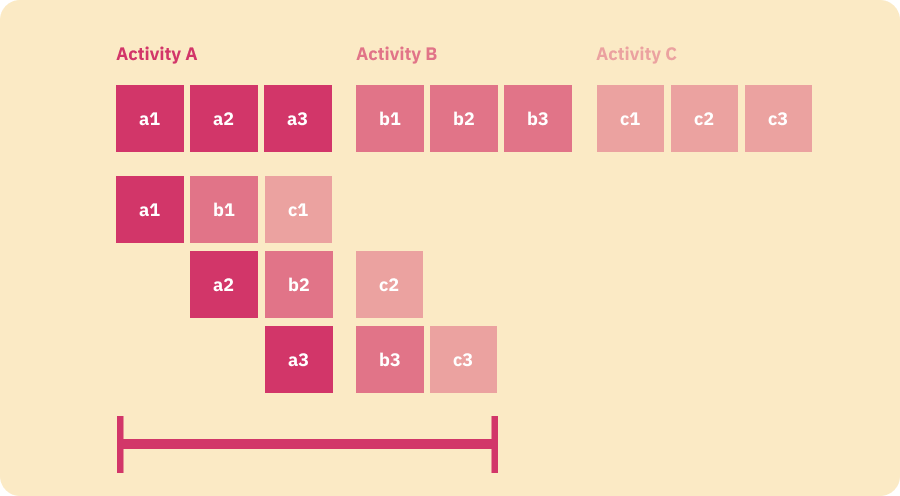

We live in a totally synchronous world, where information is constantly being generated, consumed, transformed and ingested by our brains. Same of us fell good by this perceived control over their data consumption and over the fact that our understanding of the world improves with this information ingestion. Others, like myself, try as hard as possible to have a lighter information intake, a light synchronous interaction while trying to get a more asynchronous approach to information capturing, work and learning. 

Information doesn't necessarily mean knowledge and as a result it generally doesn't translate into value.

At the beginning of last year when the world emerged into this new reality of working from home I had fun writing a couple of thoughts on this topic, specially around how most organizations and individuals should tap into new ways of working not only as a way to adapt to this new reality, but also as a way to be more productive. And yes, I do believe that we are way more productive by working from home, by having more asynchronous type of collaboration and way less meetings, calls and constant messaging. 

For more reference you can check the following posts: 

- [The future of work needs smart collaboration](/blog/2020-05-10-the-future-of-work-needs-smart-collaboration)
- [The future of work needs a better communication tool](/blog/2020-05-05-the-future-of-work-needs-a-better-communication%20tool)
- [The future of work needs to give you back your schedule](/blog/2020-05-18-the-future-of-work-needs-to-give-you-back-your-schedule)

I don't think my views have changed that much. If anything I really think that companies need to take this very seriously as what I have been observing is that most try to replicate the typical synchronous human interactions we use to have in the office with different types of technologies, from Video Conferencing to Direct Messaging now humanity is flooded with all sorts of synchronous types of interactions that in my view don't necessarily accelerate collaboration neither add much value. 

Please bear in mind that I write all this as a way to learn more about this topic, I am not an expert on the matter, neither that is my goal. However, I fell that by writing about this I start to better understand how things work and that gives me a different perspective about this very important aspect on the way we currently work.

# Synchronous vs Asynchronous

Human beings interact with one another in multiple ways, the vast majority of times we are organic in our approach to communicate and exchange information and we do it via a 1-0-1 conversation or a meeting with more participants. This is what is called a synchronous type of interaction, it is dynamic, fluid but most of the times divergent and non conclusive.

On the other side of the aisle you have an asynchronous type of work where individual work permeates your agenda. The output of that work can be in a written format where the author had to thought about the problem at hand a little bit more deeply, without distractions and in a more convergent and conclusive way.

In a perfect scenario you balance both types of interactions in order to achieve the best possible outcome.

Given my Industrial Engineering background (and my personal bias) I reckon the best way to explain this two concepts is with factory flour analogies and examples:

## Synchronous

A synchronous type of production system lines up all the activities that need to be done for a certain task to be completed, divides them by topic, aligns them and boom, whatever you are trying to do, gets done. 

However given the way that activities are aligned, the overall time one will take to finish the task at hand will be dictated by the sum of total activities.

## Asynchronous

The asynchronous type of approach differs from the synchronous one given that it doesn't align activities by topic, but rather by time and dependency totally unbundling the different type of activities and organizing them in order to accomplish the overall task at hand in the shortest time possible.

As you can see the asynchronous approach is the clear variant we should select for any organisation, why should we aim for more synchronous type of work when actually we know that the asynchronous way of working is clearly more performant?

Well, simply put it is easier to organise work around synchronous ways of thinking as that is how the vast majority of people are used to collaborate.

# Synchronous communication

Generally speaking people are more inclined to communicate in a synchronous manner, we tend to set up a meetings, "grab coffees", "chat over lunch", spin off a call or message people and expect an immediate response. 

All this types of communication are valid and very useful specially if we are talking about a strategic discussion, interviewing someone and the classic performance review. However I truly believe that most meetings and video calls could and should be replace by proper documentation and in effect with asynchronous ways of working.

The problem with replacing meetings with proper documentation is that for the most part this is not a simple abstraction to grasp given that we are all humans and we typically tend to attribute more importance to face time and to how people interject and interact in meetings. 

From experience and observation this promotes an uneven playing field, where typically the more senior or perhaps the best communicator will clearly have the advantage.

By and large I am not saying that synchronous communication is a bad thing, just trying to highlight that we shouldn't default to it as our preferred way of working as it is very inefficient and doesn't necessarily permeate value generation.

# Asynchronous communication

Personally I think the above illustrations alone should suffice to embrace this way of working and as a result organizations should give more emphasis on diminishing the number of synchronous types of interactions and incentivize more asynchronous work. However that tends to be rather hard to do as it is generally a big culture change and, like any other culture change, needs to start from the top.

What is interesting is that humans are not particularly good at multitasking, though most of people that I know tend to believe they are. It is generally hard for humans to think deeply about something and quickly change to a totally different topic altogether. This abrupt state change not only totally breaks the flow of what you were previously thinking about, but also will not allow you to go deep on the new topic that you just got yourself pulled into. Unfortunately this is what typically happens in more synchronous type of organisations.    

This approach uses good documentation, written procedures, messaging over calls (without expecting and immediate response). Most importantly this approach is more about attitude.

# A light explainer on documentation

I never consider myself good at documentation, actually quite the opposite to be honest. But them I started to code, well I started to learn web development and very soon my appreciation for good documentation started to emerge.  

Basically the better the documentation the quicker you are able to assimilate knowledge and the faster you actually can do things by your own basically leveraging the great work that others did when putting that documentation together. 

The culture of documentation is not only present in the developer community, designers, specially UI and UX designers, are very good at that with their design system and styling documentation.  

In order to break silos and let knowledge propagate it is critical that organisations adapt and embrace documentation so that Asynchronous collaboration is possible, because at the end of the day what you actually want to do is to create this culture where people actually are able to work alone, think deeply about the topic for long periods of interrupted time.  

In my mind the future needs to be more asynchronous.

