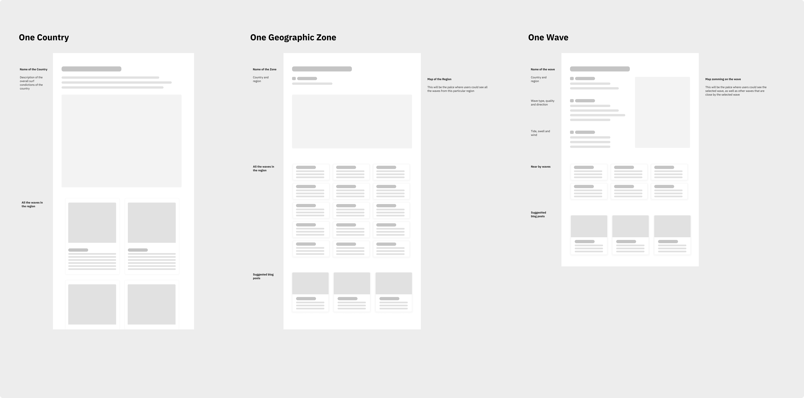
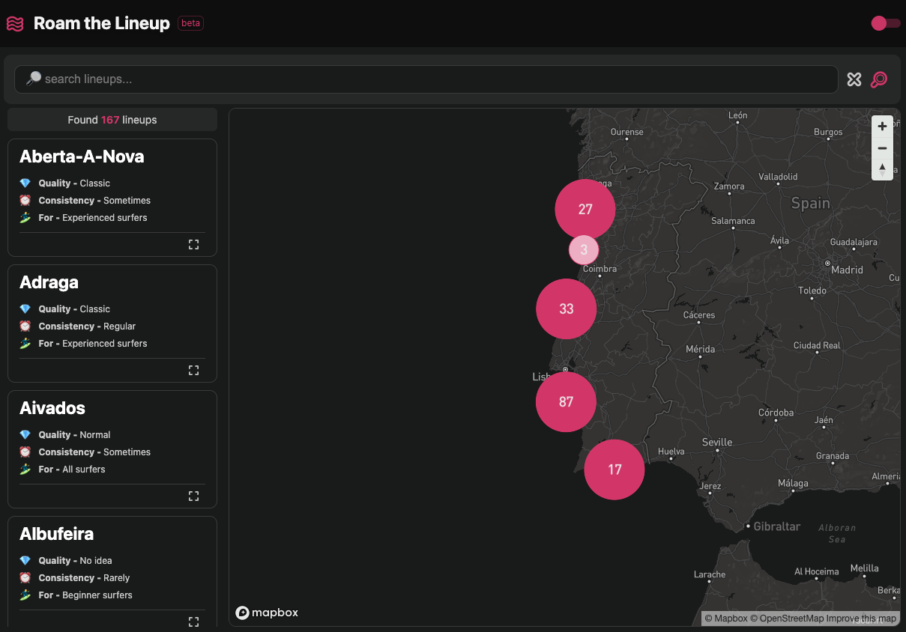
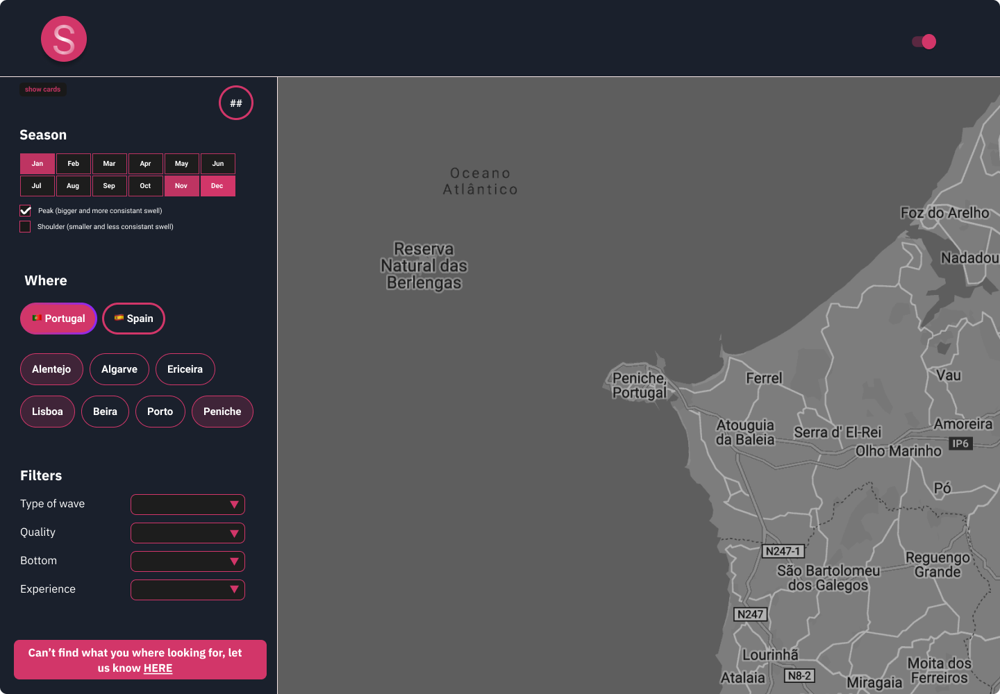
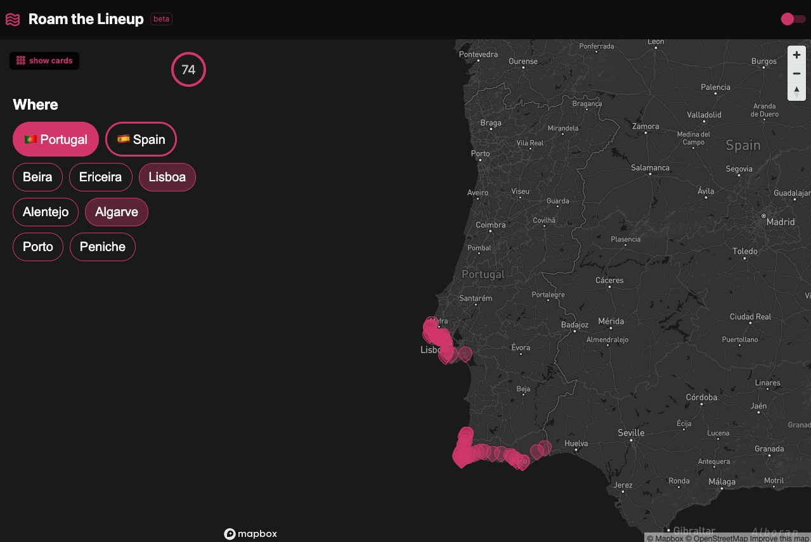

import { Button } from "theme-ui";

August is a special month for me. 

For several different reasons. Firstly, because I was born in August, secondly because it markets my 8 year anniversary in Singapore - yes time flies by incredibly fast and I have been living in Singapore for 8 years now.

I started to code in August, about 3 years ago and back then I had no idea that I would be able to do anything remotely close that what I am able to do now. Not necessarily to brag or anything like that, but I came a long way.

My new side project is far from perfect, however I have decided that this would be the perfect timing to write about it. The perfect moment to hit the pause button and put some thoughts and share them with everyone. 

There you go, my new side project: [Roam the Lineup](https://www.roamthelineup.com/), a little corner on the internet where I am trying to organize all the the waves in the world, making it easy for surfers to wander where to go next considering seasonality and when they want to surf.

# About Roam the Lineup

Like many other projects out there this one starts with passion. 

I grew up surfing, obsessed about waves, about the next surf trip to my favorite spot, counting the weekdays for the weekend so that I could grab my board and head to the beach. I used to spend hours in forecasting websites and to be honest the inspiration for this project comes from those days, from those same websites, from that extraordinary feeling of roaming around in search for the next wave, the next secret spot. 

Most of these websites and apps are phenomenal and really help the surf community to check forecasting, tide, weather conditions and when one should head to one's favorite surf spot. However, I always felt that the this type of information would be only good for surfers in local communities, for folks that already know the wave and spot and want to know when to head out. Personally I always felt that searching for waves for your future surf trip, depending on the best season and your availability, something rather annoying and most of the current websites aren't necessarily designed to cater for that. 

[Roam the Lineup](https://www.roamthelineup.com/) is all about ease of search, where the user will be able to check the best waves depending on the time of the year he wants to surf and seasonality of the wave itself. Ambition wise, and still a big hypothesis to be tested, I reckon it would be a good value proposition to also help the user with suggestions of places to stay, eventually surfcamps that are relevant for the wave selection the user is looking for.
Needless to say that I am not there yet, but it is ok to have some sort of direction that is not necessarily set in stone and will eventually mature as this project develops.

# How it all started  

What you are currently seeing was build in 4 months, but I guess it started 3 years ago, when I started to learn to code.

From a more practical standpoint it started with will a wireframe study, where I was basically trying to understand how to best offer this information to users, what type of data points would be relevant for users and how should I go about building my backend to support all this. 

**A big caveat**: I did no validation whatsoever and I started to work under my own personal assumptions and generally speaking I would not suggest this approach for a couple of different reasons. To start with, I am not totally sure if there are any other users like me, that would like to have all the waves in the world searchable depending on the time of the year you want to travel and seasonality - I can only assume that I represent a subsection of all the surfers out there... and that at the end of the day my educated guess makes sense. 

Having said that, it is also important to mention that this project, personally speaking, is a bit bigger than just trying to establish product market fit. I wanted to go as deep as I possible can in building something, from putting together a simple design system, to building the backend and putting together the frontend and testing it with users. Needless to say that I am also thinking about what content should be shown, about future integrations that I would need to have in order to make this relevant and meaningful for the surf community.

In short I am not just trying to validate if this is a problem space worth pursuing (and this can be a big mistake), I am however trying to learn more about how every single function plays - or should - it's role in the creation of a product, by doing it. I mean, by literally doing all the things that need to be done to ship something to users. 

# The mindset

Exactly 1 year ago I wrote something [about having a 100 day project mindset](/blog/2020-08-20-about-having-a-100-day-project-mindset), where I refer to the struggle of learning something new and the fact that humans are terrible at it. The psychologist **Herman Eddinghaus** explains this very well and coined this problem the 24hr memory drainage. 

He also proposes a handful of simple solutions to improve learning efficiency, effectively to retain what you just learnt. The mentioned post covers that and I will not go into detail here. But at the end of the day it is clear that any topic, from any field of knowledge, that you study beyond mastery you are likely to remember longer. The catch is that for you to be able to achieve that, you need to put in the work. You need to do, whatever you are trying to do, everyday. It needs to be part of your routine.  

That mindset stuck with me and for the past 4 months I have been working on this side project everyday. Literally every night from the moment I put the kids to bed till 1:00 am.

# Small, but important improvements

The previous implementation of the dynamic map looked good, but was not working properly. 

I shared the project with a couple of friends and a lot of them pointed out a couple of functionality problems on that page. Same point out that when pressing the back button, they could not go back to where they previously where. Others mentioned that the search was only useful if they knew the wave, specially because autocomplete was not working. 

After receiving feedback I knew I add to learn how to better manage routing and connecting queries, filters and selections the user passed to the application so that it could actually perform as expected. I also decided to drop the search functionality as this is a very challenging thing to build (will potentially use algolia further down the line).  

Ok, so it seemed that I needed to re due this page and as always I started to play with figma and came up with the following wireframed. 

I was happy with the design and with the clear separation of concerns between the search bar, located on the left side of the screen and the map, on the right side of the screen. 

The idea for the search bar is simple, the user will be able to: 
- Choose the month to surf and the season type
- The search will react to this inputs and will provide the countries within that definition
- Selecting the country will enable the user to select the regions to explore
- The waves start to be populated on the map and the user could learn more about the waves there
- There will be filters that the user will be able to select to further help on the search.

On the map section the user will be able to explore the waves on a map or an a list of cards.

Bellow you can see the implementation. It is still missing both the season section of the filter and the overall filter capability. Needless to say that this is still WIP and something that will be added soon. (Note: will start with implementing the filters as the season will need backend changes as well as gathering the relevant information).

<Button style={{textAlign: `center`}}><a href="https://airtable.com/shrOnYxbM5juIdW0F" target="_blank" rel="noopener" aria-label="feedback for roamthelineup" style={{color: `white`}}>Feedback here, please</a></Button>

# Mistakes and learnings

Oh boy... I have made so many mistakes that I hardly know where to start. Also I don't want to make this post so much about the mistakes and learnings, however not mentioning a few of them here would not make justice to this project, the challenges and to how much I still need to learn. Not to sound a cliche, but the more I know and learn the more comfortable and adventurous I fell and the more mistakes I do. As a result I always end up felling that I know very little. 

A couple of things to think about: 
- Not using autoincrement as id but use uuid
- It is not smart to have 167 items with 15 relations being queried in one query (thank you for that Chris :))
- Using URLSearchParams to better manage the routing, to append and delete params
- I should have picked up a UI system to make my life easier (perhaps)
- Still not sure if nextJS is better for this project than gatsbyJS
- Apollo client vs React Query
- ... 

# What to do next?

In the here and now I know that I need to focus on a couple of things: 

- 🗂 **Filters** on the map
- 📜 **Wave Content** getting it right
- 📈 **Wave Forecast** and integration with magicseaweed
- 🌄 **Wave Pictures** for every wave

My wishlist, the wishlist of things that I want to do but likely will not have time to do, but will try :). 

- ⭐️ **Favorite waves** bookmark feature
- 🎙 **Comments and discussions** about the wave
- 📍**Services and business** around everything surf related
- 🌎 **Community** to bring users together to discuss waves and their favorite places
- 🌊 **Waves** for different countries
- 📝 **Blog** with nice contextual content that will help anyone that searching for the next adventure

What do you think? What are the next features that I should be focusing on? 

Your <a href="https://airtable.com/shrOnYxbM5juIdW0F" target="_blank" rel="noopener" aria-label="feedback for roamthelineup">feedback</a> about the project will be very much appreciated (it will only take you 1 minute, really!) and will go a long way so that I can focus on right feature to improve this project. 