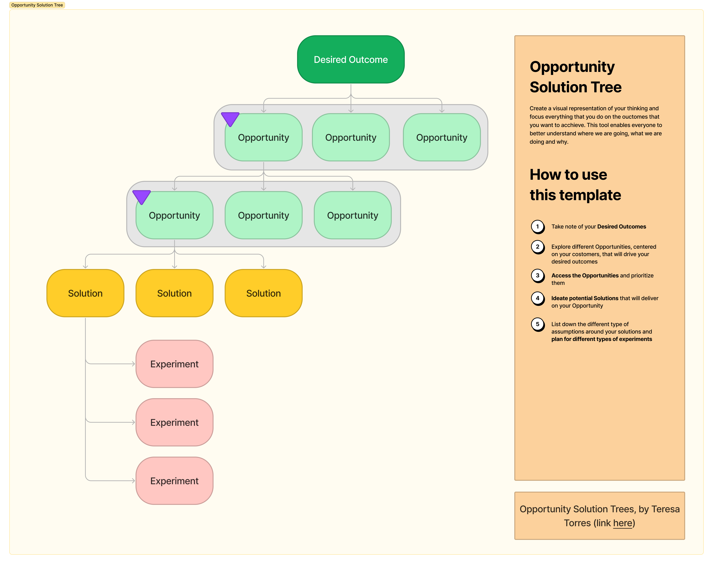

import { Message } from "theme-ui";

Experimentation is one of the most important things to do when building digital products.

Personally, I am a big proponent of [experimentation programs](/blog/2022-05-27-the-case-for-an-experimentation-program/) and doing [ab testing](/blog/2022-05-19-ab-testing-a-way-to-grow-your-business/) in order to grow the business and learn more about the users, however one of the biggest challenges with that is figuring out what to test and more importantly, making sure that we connect the experiments with business outcomes the organization wants to achieve.

For already existing flows and journeys the thought process should be simple, you should be fixing the biggest leaks on your customer journey. The overall idea would be to think about experiments that can keep the users on track and / or bring them back.

We also want to connect the experiment with a business outcome, with our OKR's or with our north start metric so that we acting on something that will lead our business forwards and impact out overall results.

Making sure that our tests are aligned to our OKRs is not necessarily easy, we can get busy with a technical experimentation that is not necessarily aligned with our OKRs or busy with a prototype for a new marketing effort on a new business vertical that is not part of the expected business outcomes.

This is where I found the opportunity solution tree framework, by Teresa Torres very helpful - It pushes the thought process to evolve around the (1) business outcome that we want to achieve, (2) to map the opportunities related to business outcomes, (3) to think about the solutions that would make sense and (4) put together experiments that would be helpful to prove / disprove our solutions.

# Opportunity Solution Tree

After reading Teresa's book - Continuous Discovery Habits - I also learnt that this framework (more like a mindset to be honest) can be very helpful in a couple of different ways:

- By focusing to be outcome driven you get out of the feature factory conundrum;
- Considering pain points, needs, wants or desires as opportunities grounds everything around the user;
- Contrasting and comparing the opportunities will force a prioritization that outcome-driven and not top-down;
- By validating the solutions with a couple of experiments we de-risk our delivery;

## Outcomes

This are

## Opportunities

## Solutions

## Experiments

 
<Message>
  Please note that these views are my own and might not represent my employer's
  views.
</Message>
